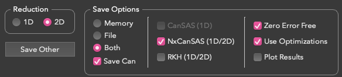
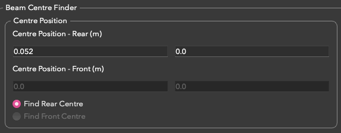

============
SANS Changes
============

.. contents:: Table of Contents
   :local:

New Features
------------
- Metadata indicating the subtracted workspace and the scale factor is now saved to CanSAS1D and NXCanSAS subtracted
  output files when a :ref:`ISIS_SANS_scaled_background-ref` has been performed. This information is located in
  ``SASprocess``.
- All beam centre settings can now be left uncommented in the TOML file. The appropriate beam centre values will now be
  selected based on the ``selected_detector`` setting from the TOML file or ``Reduction Mode`` setting on the GUI.
- Switching between a custom output file and an automatically-generated one can now be performed using the
  ``Enter Custom Filename`` checkbox on the :ref:`Sum Runs tab <ISIS_SANS_Sum_Runs_Tab-ref>` in the
  :ref:`ISIS SANS GUI <ISIS_Sans_interface_contents>`.
- The :ref:`algm-SANSTubeCalibration` algorithm now takes a filepath to optionally save out the list of calibrated tubes
  that exceed the ``CValueThreshold``. Additionally, the ``cvalues`` workspace in the Workspaces list is now suffixed
  with the detector name. The algorithm has also been changed to allow a directory to be specified for saving the
  integrated input workspaces, rather than simply saving to the user's default Mantid save directory.
- To improve clarity of metadata, :ref:`algm-SaveCanSAS1D` and :ref:`algm-SaveNXcanSAS` will now save the aperture
  shape as ``Unknown`` if it is not explicitly given in the algorithm parameters.

Bugfixes
--------
- Process metadata has been moved from ``sasnote`` to the parent ``sasprocess`` when saving using
  :ref:`algm-SaveNXcanSAS`. This allows data analysis tools like SASView to read in this information correctly.
- The option to save an output file using :ref:`algm-SaveCanSAS1D` has now been disabled if the reduction mode is set to
  2D on the :ref:`ISIS_SANS_Runs_Tab-ref`. While the algorithm is able to handle 2D data without crashing, the output
  file it produces is not meaningful.

- The :ref:`ISIS_SANS_Runs_Tab-ref` will now return to its default output options when the reduction mode is switched
  between 1D and 2D.
- Background Subtracted (``_bgsub``) workspaces are now correctly deleted when ``File`` is selected as the save
  location in the :ref:`ISIS SANS GUI <ISIS_Sans_interface_contents>`.
- Fixed a crash when a sample run cannot be found in the Mask tab of the :ref:`ISIS_SANS_Settings_Tab-ref`.
- The :ref:`Beam Centre Finder's <ISIS_SANS_Beam_Centre_Tab-ref>` bank selector has been simplified to remove unneeded checkboxes.

- When the instrument is set to LARMOR, the Beam Centre Finder's position labels now indicate that the given values
  should be in meters (m).
- Beam shape & size, sample thickness, and detector information is now correctly saved by :ref:`algm-SaveCanSAS1D`
  and :ref:`algm-SaveNXcanSAS`.

:ref:`Release 6.9.0 <v6.9.0>`
