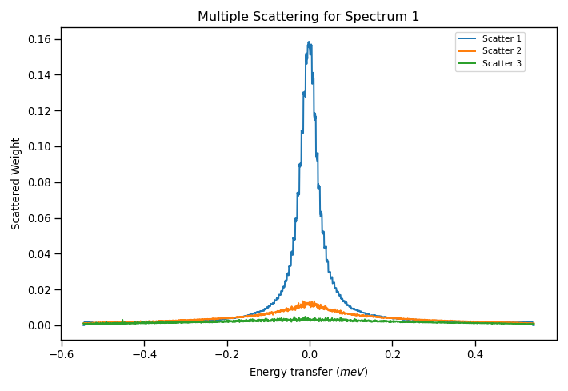
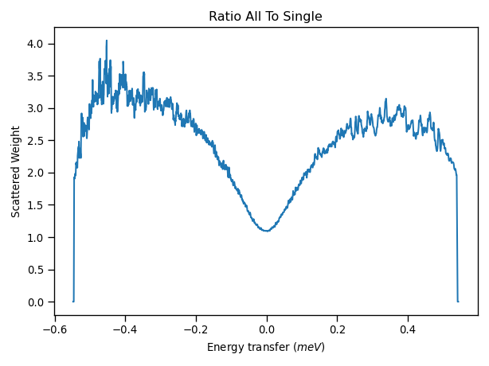
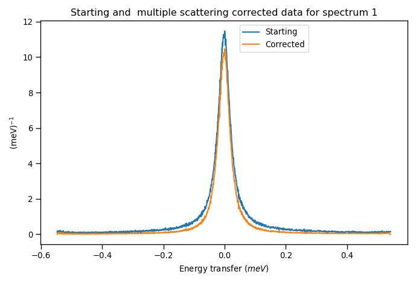
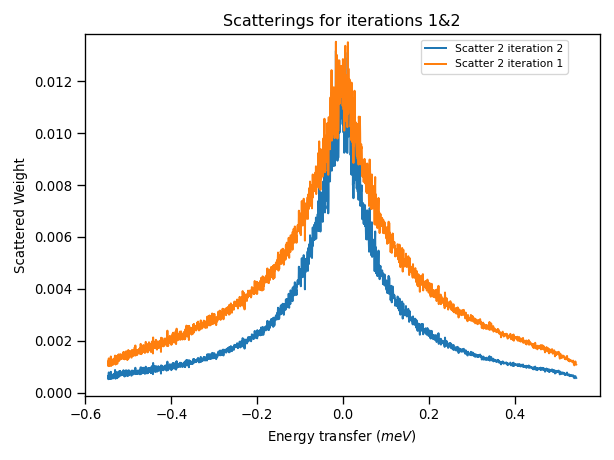
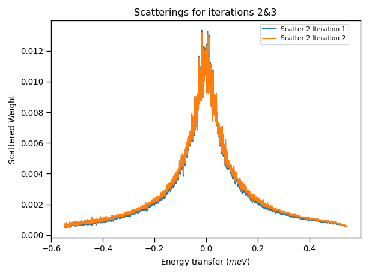

.. _applying_corrections:

Applying Corrections
====================

.. contents:: Table of Contents
  :local:

Introduction
------------

Neutron Data from spectrometers sometimes requires taking into consideration the contributions from Absorption and Multiple
Scattering processes from the sample and the container. This section gives an overview of considerations and techniques when applying corrections in Mantid with data obtained
from an indirect geometry spectrometer.

In the :ref:`Inelastic Corrections <interface-inelastic-corrections>` interface of Mantid Workbench, it is possible to calculate and apply different absorption correction routines, such as the Paalman-Pings
formalism. The algorithm used for these corrections is :ref:`PaalmanPingsMonteCarloAbsorption <algm-PaalmanPingsMonteCarloAbsorption>`.
To calculate corrections for multiple scattering events, the :ref:`Discus Multiple Scattering <algm-DiscusMultipleScatteringCorrection>` algorithm can be used.
This algorithm is based on M. Johnson's DISCUS fortran program [1]_, which has been adapted and refactored to run within Mantid.
For Inelastic geometry instruments, we can additionally use the :ref:`SimpleShapeDiscusInelastic <algm-SimpleShapeDiscusInelastic>` algorithm, which is also based on DISCUS.
More information about the theory and application of absorption and multiple scattering corrections can be found in the :ref:`Absorption and Scatering Corrections <Sample Corrections>` documentation.

There are some features of these algorithms to consider when applying absorption and multiple scattering corrections in Mantid:

1. They can be used for diffraction measurements and both with Indirect and Direct Inelastic geometry instruments.

2. A scheme for having more complicated sample environment may be defined in an XML file. For example: flat plates could include the outer frame, or different cylindrical geometries for
   the containers can be stored within Mantid Workbench.

3. Calculating corrections requires knowledge of the scattering angle for each spectrum thus a reduced workspace must be used.

4. There is an option to reduce computation time for multidetector instruments with large numbers of pixels using sparse instrument configurations.

We are going to illustrate a process of performing absorption and multiple scattering corrections produced and analysed within Mantid Workbench with a liquid sample, in this case water, acquired with an Indirect geometry instrument.

Absorption and Multiple Scattering Corrections on a Water sample
----------------------------------------------------------------
Sample
^^^^^^
A water sample acquired in the IRIS spectrometer `irs26176_graphite002_red.nsx` from the Mantid Usage Data set is used.
Characteristics of this sample are:

- Sample: Liquid Water (:math:`H_2O`), with 1 mm thickness  and 3 cm height sample.

- Container: Annular aluminium cylinder with 1 mm wall thickness.

- Calibration: Sample and container were calibrated with a Vanadium container.

- Detector: Indirect Spectrometer is IRIS with 51 individual detectors.

Absorption Corrections
^^^^^^^^^^^^^^^^^^^^^^

Firstly, we can calculate and apply neutron absorption corrections for the sample and container by using the  :ref:`Monte Carlo Absorption <algm-PaalmanPingsMonteCarloAbsorption>`
algorithm in the :ref:`Inelastic Corrections <interface-inelastic-corrections>` interface. Opening the interface, we navigate to the
`Calculate Monte Carlo Corrections` tab. Selecting the `irs26176_graphite002_red.nsx` sample dataset with an annulus sample shape of the aforementioned dimensions.
For sample and container chemical formula, we type `H2-O` and `Al`, respectively. Leaving all other parameters as default.
Running the algorithm we generate a corrections group workspace. This workspace can be used in the `Apply Absorption Corrections` tab of the interface
to generate a corrected reduced workspace.
The corrected reduced workspace can then be used to generate the :math:`S(Q, \omega)` profile from the `S(Q,w)` tab of the :ref:`Data Processor Interface <interface-inelastic-data-processor>`.
A 3D plot of the generated workspace is shown below:

.. figure:: ../images/water_sqw_corrected_for_absorption.png
   :alt: water_sqw_corrected_for_absorption.png

The :math:`S(Q, \omega)` workspace will be used to generate multiple scattering corrections.

Multiple Scattering Corrections
^^^^^^^^^^^^^^^^^^^^^^^^^^^^^^^
We are going to calculate the multiple scattering corrections using the :ref:`SimpleShapeDiscusInelastic <algm-SimpleShapeDiscusInelastic>` algorithm from the algorithms widget.
On this algorithm, the input workspaces are:

1. The reduced absorption corrected workspaces to provide the scattering angles.

2. The :math:`S(Q, \omega)` calculated from the reduced corrected workspace to calculate the scattering.

The sample shape and container dimensions are similar to the ones used for absorption corrections.
Additionally, we can also include the effect of multiple scattering of the container in the algorithm. Although, for ease and simplicity,
the scattering from the container is assumed to be isotropic and a :math:`S(Q, \omega)` file is thus not required, only the container dimensions and material.

For this example, we will use 4000 scattering paths to calculate up to 3 consecutive scattering events. The calculations of this algorithm, based on Monte Carlo sampling,
are quite CPU intensive. Depending on the platform, it can take a time between 10 and 30 minutes to finalize processing. This example was run
with a Cloud Computing rack equipped with 16CPU.

Once the algorithm is finished, an output group workspace with several 2D Workspaces will be generated.
The scattering weights per spectra for 1,2 or 3 scattering events will have a corresponding 2D workspace.
Plotting these weights for the first spectrum results in the following graph:

From this figure, it appears that the weights for 3 scattering events are practically zero, and negligible in comparison with the other 2 terms.
We could then assume only 2 scattering events in the computation of succesive multiple scattering corrections to reduce computation time.
Additionally, we can find in the output group workspace the ratio of all scattering events to a single scattering (as well as its inverse curve).

Noticeable from this ratio is that the scattering weight ratio increase in the wings of the curve, where they contribute to an enlargement of the
measured width, and thus could be appearing in fitting routines as extra peaks.

The reduced absorption workspace can then be corrected by multiplying it to the `single_to_all` ratio workspace.

Iterative multiple scattering corrections
^^^^^^^^^^^^^^^^^^^^^^^^^^^^^^^^^^^^^^^^^
In the calculation of the multiple scattering corrections using the :ref:`SimpleShapeDiscusInelastic <algm-SimpleShapeDiscusInelastic>` algorithm, we have
used a :math:`S(Q, \omega)` file which already contained multiple scattering terms, as we obtained from the workspace.
In this case, it would improve upon the multiple scattering results if we perform a second iteration on the :ref:`SimpleShapeDiscusInelastic <algm-SimpleShapeDiscusInelastic>` algorithm,
but this time using the new :math:`S(Q, \omega)` calculated from the multiple scattering corrected reduced workspace.

Comparing the results of the scattering weight amplitudes on 2 scattering events from the first and second iteration we can observe
that the scattering for the second iteration is slightly smaller, this is the result of using the corrected :math:`S(Q, \omega)`.
If we perform another iteration, correcting the reduced workspace with these results and recalculating the :math:`S(Q, \omega)`, we arrive
at the following results from the third iteration:

This plot now shows that the difference between the scattering weights in iterations 2 and 3 is negligible, and thus we are not
correcting further by continuing with the iteration procedure and can stop applying multiple scattering corrections.

Effect of Multiple Scattering Corrections on Peak Widths
^^^^^^^^^^^^^^^^^^^^^^^^^^^^^^^^^^^^^^^^^^^^^^^^^^^^^^^^
We can then use corrected multiple scattering data to model the quasielastic response with a convolution fitting algorithm.
If we convolute with a lorentzian, we can apply the multiple scattering corrections to the reduced workspace as described above
and then run ConvFit algorithm as normal.
Plotting the FWHM obtained from convolutional fitting with and without applying corrections:

.. figure:: ../images/FWHM_for_Water_with_without_multiple_scattering_corrections.png
   :alt: FWHM_for_Water_with_without_multiple_scattering_corrections.png

The corrected data shows smaller widths indicating that the multiple scattering increases the peak widths, which shows the effect of the extra wing scattering.

Another method to apply the multiple scattering corrections would be to scale the model function, e.g. Lorentzian, by the multiple scattering corrections
and then fit the reduced workspace. In this case, we would disentangle the resolution broadening of the :math:`S(Q, \omega)` from the broadening occurring
from multiple scattering corrections.

References
----------

.. [1]  M.W.Johnson, (1974). *Discus: A computer program for calculation of multiple scattering effects in inelastic neutron scattering experiments*. Report AERE-R7682 UKAEA AERE Harwell, Oxfordshire. `Report <https://www.isis.stfc.ac.uk/Pages/discus-manual6827.pdf>`__

.. categories:: Techniques
