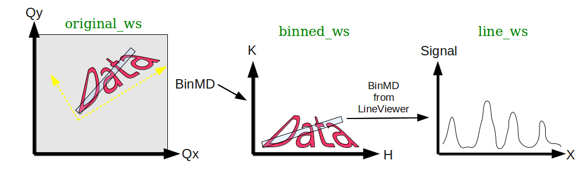

.. _BinMDCoordinateTransformations:

BinMD Coordinate Transformations
================================

.. contents:: Table of Contents
  :local:

Introduction
------------

The algorithms :ref:`algm-BinMD` and :ref:`algm-SliceMD` allow an :ref:`MDWorkspace` to be binned into a new coordinate
system. This guide describes the coordinate transformations and relations between binned workspaces.

Binning an MDWorkspace
----------------------

- Begin with an initial :ref:`MDWorkspace` called ``original_ws`` with two dimensions, ``Qx`` and ``Qy``.
- The :ref:`algm-BinMD` algorithm can transform these coordinates into a new coordinate space with, for example, a
  rotation and a translation:

.. figure:: ../images/BinMDCoordinateTransformations/BinMD_Coordinate_Transforms.png
   :alt: Coordinate transform line example
   :align: center

- The output :ref:`MDHistoWorkspace`, called ``binned_ws`` still has two dimensions, now called ``H`` and ``K``.
- The ``binned_ws`` workspace holds a reference to the original workspace.

  - This can be seen in the details of the workspace in the Workspaces widget (``Binned from 'original_ws'``).
  - In C++, calling ``binned_ws->getOriginalWorkspace(0)`` will return a pointer to ``original_ws``.

- It also holds the coordinate transformations between workspaces:

  - ``(H, K) -> (Qx, Qy)`` : Binned coordinates back to original coordinates.

    - In C++, this can be accessed via ``binned_ws->getTransformToOriginal(0)``

  - ``(Qx, Qy) -> (H, K)`` : original coordinates to the binned coordinates.

    - In C++, this is accessible via ``binned_ws->getTransformFromOriginal(0)``

- When moving the mouse in the :ref:`sliceviewer`, for example, the coordinates in BOTH spaces will be displayed.

Binning a Line From an MDHistoWorkspace
---------------------------------------

It is possible to call :ref:`algm-BinMD` on an :ref:`MDHistoWorkspace` that has already been binned.
For example, if you are viewing ``binned_ws`` in the :ref:`sliceviewer`, you can use the
:ref:`Non-axis aligned cutting tool <sliceviewer_nonaxiscuts>` to bin a line from that.

- Say you bin ``binned_ws`` to a line with a width: ``line_ws``.

  - The ``line_ws`` workspace has 2 dimensions (since it has a width).
  - The dimensions of ``line_ws`` have the generic names: ``(X,Y)``.
  - Only the ``X`` dimension has more than one bin, but the ``Y`` dimension still exists.
  - Each point in ``(X,Y)`` space has an equivalent in ``(H,K)`` and in ``(Qx,Qy)`` space.

- The integration will actually be performed on the event data in the ``original_ws``.
- There are then two 'original' workspaces recorded in 'line_ws':

  - ``line_ws->getOriginalWorkspace(0)`` returns the ``original_ws`` (the event data).

    - ``line_ws->getTransformToOriginal(0)`` returns the ``(X,Y) -> (Qx,Qy)`` transform.
    - ``line_ws->getTransformFromOriginal(0)`` returns the ``(Qx,Qy) -> (X,Y)`` transform.

  - ``line_ws->getOriginalWorkspace(1)`` returns the **intermediate** workspace ``binned_ws`` (the 2D histogram data).

    - ``line_ws->getTransformToOriginal(1)`` returns the ``(X,Y) -> (H,K)`` transform.
    - ``line_ws->getTransformFromOriginal(1)`` returns the ``(H,K) -> (X,Y)`` transform.

- When using the ``Plot MD`` menu on the ``line_ws``, you can display the plot as the coordinates of the intermediate
  workspace.

  - In this example, this would be the ``(H,K)`` coordinates.

.. categories:: Techniques
