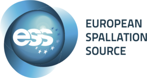
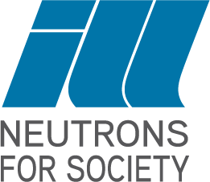
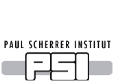

.. _connecting_data_to_instruments:

==============================
Connecting Data To Instruments
==============================

Mantid supports Neutron and Muon Science at many `collaborating facilities <https://github.com/mantidproject/governance/blob/main/facilities.md>`_ .

Feel free to checkout the instrument sections of each facility website.

|ANSTO_logo.gif| |CSNS_Logo_Short.png| |ess_logo_transparent_small.png| |ILL_logo.png|

|
|

|ISIS_Logo_Transparent_UKRI.png| |Julich.jpg| |ORNL_logo.jpg| |Psi_logo.png|

|
|

.. toctree::
   :hidden:
   :glob:
   :maxdepth: 1

   01_introduction
   02_displaying_and_navigating
   03_investigating_data
   04_masking_and_grouping
   05_instrument_tree
   06_sample_logs
   07_invalid_sample_logs
   08_exercises_c

**Sections**

* :ref:`01_introduction_conn`
* :ref:`02_displaying_and_navigating`
* :ref:`03_investigating_data`
* :ref:`04_masking_and_grouping`
* :ref:`05_instrument_tree`
* :ref:`06_sample_logs`
* :ref:`07_invalid_sample_logs`
* :ref:`08_exercises_c`

.. |ANSTO_logo.gif| image:: ../../../../../images/ANSTO_logo.gif
                    :width: 200px
                    :target: https://www.ansto.gov.au/

.. |ISIS_Logo_Transparent_UKRI.png| image:: ../../../../../images/ISIS_Logo_Transparent_UKRI.png
                    :width: 200px
                    :target: https://www.isis.stfc.ac.uk/

