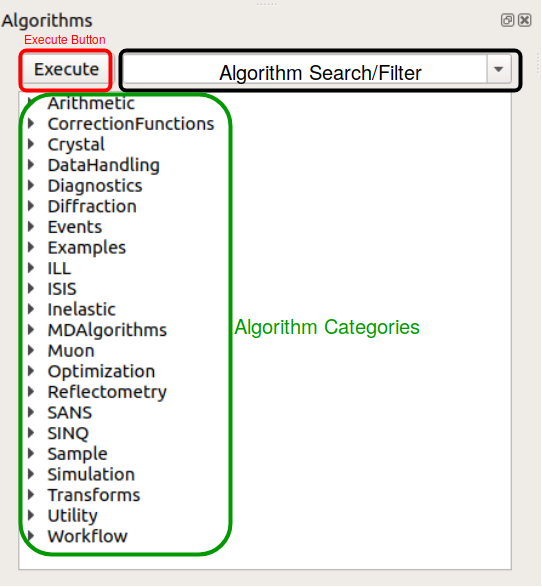
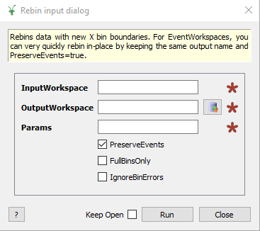

.. _WorkbenchAlgorithmToolbox:

=================
Algorithm Toolbox
=================

The algorithm toolbox offers access to all of Mantid's algorithms.
If you are familiar with MantidPlot it functions similarly. The algorithms are
listed in categories and there is also a search bar.

Execute Button
--------------

The execute button will bring up the execution dialog for the selected
algorithm.

From this window you can enter your input workspace, the parameters for your
selected algorithm and your target output workspace.

Algorithm Categories
--------------------

The algorithms are sorted into categories to make navigating easier. A list of
categories that may help you find what you're looking for can found at
:ref:`Algorithms List`. To ensure the algorithms are found in sensible places
they can be in more than one category.
