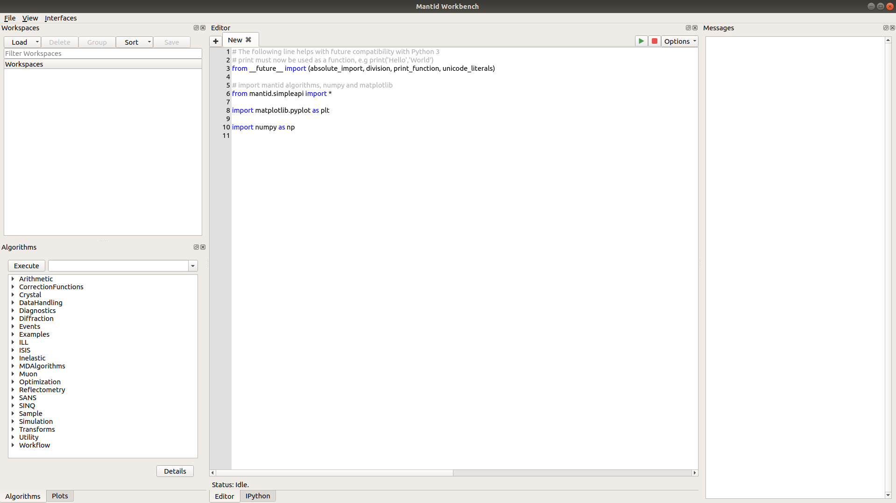

.. _workbench:

=========
Workbench
=========

.. toctree::
   :hidden:
   :glob:

   algorithmtoolbox.rst
   mainwindowmenu.rst
   messageswindow.rst
   plotstoolbox.rst
   plotwindow.rst
   scriptwindow.rst
   workspacetreewidget.rst
   whatisinworkbench.rst
   ipythonconsole.rst
   smallerfeatures.rst
   whatisnewinworkbench.rst

Mantid Workbench is the newest user interface for Mantid. The Workbench will be
included alongside MantidPlot for several releases before replacing it completely. The Workbench has been built from the
ground up to be easier to use, more stable, support automatic testing and allow future development and changes to be
completed much faster than they were in MantidPlot.  In addition it is built on more up to date toolkits that will
allow us to keep developing the Workbench long after MantidPlot is no longer available.

**What is in Workbench?**
    * :ref:`WhatIsInWorkbench` This is a summary of what is in Workbench, including a helpful diagram, naming what is
      what on the window.
    * :ref:`WorkbenchSmallerFeatures` A list of smaller features that does not warrant it's own pages including Keyboard
      shortcuts.
    * :ref:`WorkbenchWhatIsNew` Lists the new features in Workbench as opposed to MantidPlot.

**Workbench Features**
    * :ref:`WorkbenchMainWindowMenu` The new simplified menus in Workbench.
    * :ref:`WorkbenchWorkspaceToolbox` The area in which all workspaces currently loaded into Workbench can be accessed
      and edited from.
    * :ref:`WorkbenchAlgorithmToolbox` Here is all of the Algorithms availible to users to run on workspaces loaded into
      the Workspace Toolbox.
    * :ref:`WorkbenchScriptWindow` is the Main feature in workbench being right in the middle on startup, it is a python
      script editor.
    * :ref:`WorkbenchMessagesWindow` is effectively the results log from MantidPlot, all output from most sources goes
      here.
    * :ref:`WorkbenchPlotsToolbox` A way of controlling all plots that are open in a easier and better way.
    * :ref:`WorkbenchIPythonConsole` A python interpreter console that when operated has access to the Mantid API
    * :ref:`WorkbenchPlotWindow` The new way that plots are created and manipulated in Workbench, includes plot options
      and fitting.
    * :ref:`Plotting in workbench <plotting>` isn't only possible by right clicking on a workspace in the
      :ref:`WorkbenchWorkspaceToolbox` but possible via scripts!
