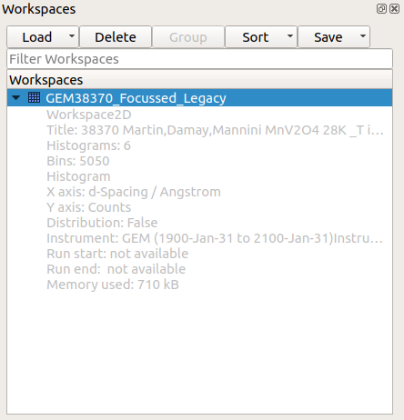
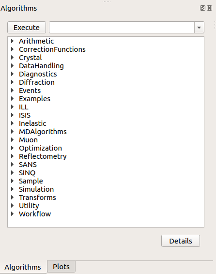
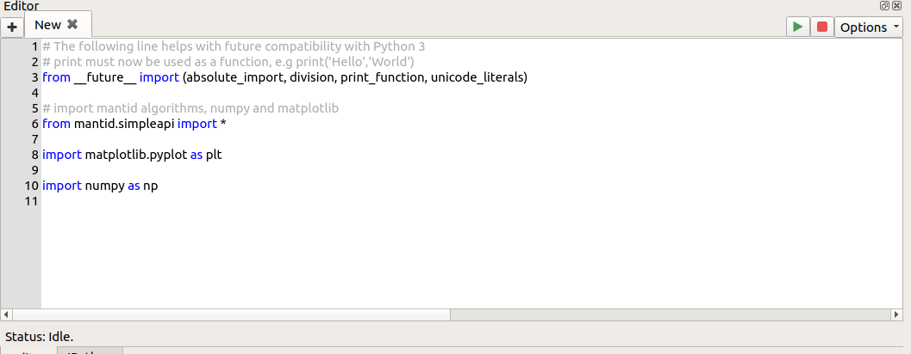
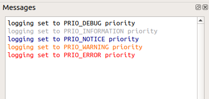
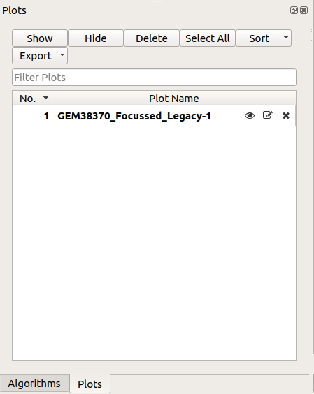

.. _workbench:

=========
Workbench
=========

.. image:: ../images/Workbench/Workbench.png
    :height: 225
    :width: 400
    :alt: Workbench
    :align: right

Mantid Workbench is the newest user interface for Mantid. The Workbench will be
included alongside MantidPlot for several releases before replacing it completely. The Workbench has been built from the ground up to be easier to use, more stable, support automatic testing and allow future development and changes to be completed much faster than they were in MantidPlot.  In addition it is built on more up to date toolkits that will allow us to keep developing the workbench long after MantidPlot is no longer available.

===========================
What is there in Workbench?
===========================

Most of what users currently use in Mantid Plot is or will be incorporated into workbench. This includes but is not
limited to, user group interfaces, scripting window (fully integrated into the main window), workspace display,
algorithm widgets, and plotting.

Workbench Windows
-----------------
One of the immediate things that is noticeable about workbench, is all the windows integrated into the main window.
These can be dragged away and out of the main window docks. Examples can be found here:
:ref:`WorkbenchDraggableWindows`.

Workspace Toolbox
-----------------

The :ref:`WorkbenchWorkspaceToolbox` is a key part of workbench and if a you are familiar with MantidPlot it function
very similarly. From here you can see all of the workspaces currently available to the User. Here you can load,
save, group, delete, sort, plot, and more a breakdown of these features can be found here:
:ref:`WorkbenchWorkspaceToolbox`

Algorithm Toolbox
-----------------

The :ref:`WorkbenchAlgorithmToolbox` is another key part of the workbench, once again if you are familiar with
MantidPlot it functions very similarly. From here you can access and run all of the algorithms that Mantid Workbench has
to offer to it's users. To find algorithms there are two options for navigation, if you know the name then doing a
search in the search bar, the other option is selecting it's category and navigating utilising the menu.

Script Window
-------------

The :ref:`WorkbenchScriptWindow` is another key part of the workbench. The script window allows you to write a python
script which integrates with the Mantid framework and operate on the data loaded in via the workspaces. The script
window contains a Status bar, multiple tabs for different scripts, the ability to play, and the ability to stop
alongside some further options explored more here: :ref:`WorkbenchScriptWindow`

Message Window
--------------

All of the output from your scripts and algorithm's ran from interfaces or other buttons will be output here. This is
alongside the ability change the logging level. The logging level has 5 different options to display the right level of
detail for you, all this and more is discussed further here: :ref:`WorkbenchMessagesWindow`

Main Window Menu
----------------

.. image:: ../images/Workbench/MainWindowMenu/MainWindowMenu.png

In your main window for workbench, you may notice a few options in the upper left hand corner. From here you can access
drop down menus which will facilitate options, to do things such as change the settings, save scripts, save projects,
restore defaults for the window and more. Further explanation can be found here: :ref:`WorkbenchMainWindowMenu`

Plot Toolbox
------------

This is a new concept in Mantid applications, the plots toolbox will encompass and display all currently shown plots
much like the workspace toolbox. It has the option to hide, remove, and edit the name of each plot individually. All
this can be done from the buttons on top of the toolbox which will allow you to perform operations on multiple plots
at once, showing, hiding and more with the click of a button. More here: :ref:`WorkbenchPlotsToolbox`

IPython Console
---------------

.. image:: ../images/Workbench/IPythonWidget.png

This is a python interpreter which has access to the Mantid API and can interface with the rest of the workbench.
Therefore, it is possible to interact with the algorithms, workspaces and plots from the Workbench, it allows you to
manipulate things much like the script window can but in an interpreter style.

Plot Window
-----------

.. image:: ../images/Workbench/PlotWindow/PlotWindow.png

This is the window in which all plots will be shown in. There are many things that are possible from this window with
regards to adjusting the the plot, saving/exporting and fitting. This topic really deserves it's own pages and thus
further descriptions can be found here: :ref:`WorkbenchPlotWindow`

Overall Workbench Diagram
--------------------------

Here is a diagram that shows where different parts of the workbench are on the default layout.

.. image:: ../images/Workbench/WorkbenchDiagram.png

