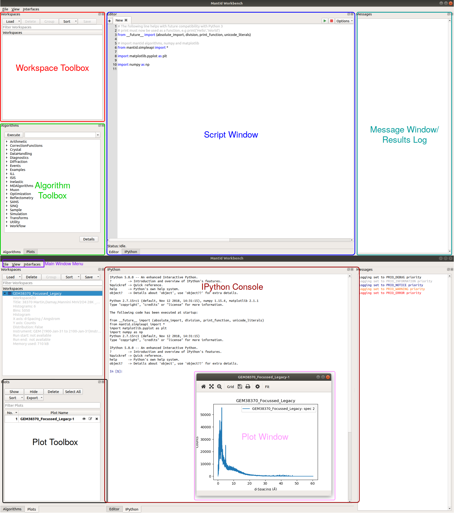

.. _workbench:

=========
Workbench
=========

TO BE RE-WRITTEN BY NICK OR MARTYN
Mantid Workbench is the newest major release of Mantid. The big changes in this release is that Workbench will be
released alongside, MantidPlot. Workbench is a completely new GUI, built from the ground up, it should be more stable
and allow for future development and changes to be completed much faster than they were in MantidPlot.

===========================
What is there in Workbench?
===========================

Most of what users currently use in Mantid Plot is or will be incorporated into workbench. This includes but is not
limited to, user group interfaces, scripting window (fully integrated into the main window), workspace display,
algorithm widgets, and plotting.

Legend
------
.. raw:: html

    

.. role:: light-red
.. role:: green
.. role:: dark-blue
.. role:: dark-cyan
.. role:: purple
.. role:: black
.. role:: dark-red
.. role:: pink

- :light-red:`Workspace Tree Widget` (Page)
- :green:`Algorithm List Widget` (Page)
- :dark-blue:`Multi-Tab Integrated Editor` (Page)
- :dark-cyan:`Results Log/Message` (Page)
- :purple:`Window Options` (Page)
- :black:`Plot List Widget` (Page)
- :dark-red:`IPython Console` (Page)
- :pink:`Plot Window` (:ref:`WorkbenchPlotWindow`)

