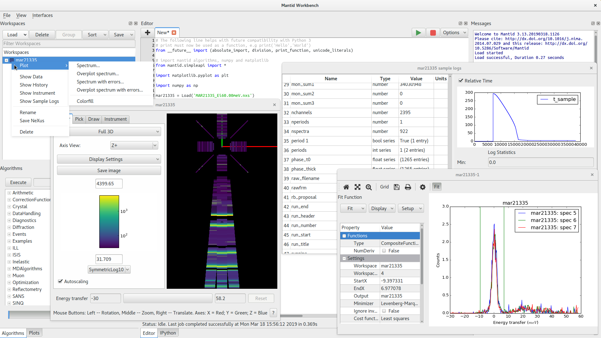

.. _workbench:

=========
Workbench
=========

.. toctree::
   :hidden:
   :glob:

   *

    Overview of the workbench

Mantid Workbench is the newest user interface for Mantid and has replaced MantidPlot. The Workbench has been built from the
ground up to be easier to use, more stable, support automatic testing and allow future development and changes to be
completed much faster than they were in MantidPlot.

**What is in Workbench?**
    * :ref:`WhatIsInWorkbench` This is a summary of what is in Workbench, including a diagram describing what is
      each aspect of the window.
    * :ref:`WorkbenchSmallerFeatures` A list of smaller features that does not warrant it's own pages including keyboard
      shortcuts.

**Workbench Features**
    * :ref:`WorkbenchMainWindowMenu`: Overview of the top-level menus.
    * :ref:`WorkbenchSettings`: The control panel for settings in workbench.
    * :ref:`WorkbenchWorkspaceToolbox`: The area in which all workspaces currently loaded into Workbench can be accessed
      and edited from.
    * :ref:`WorkbenchAlgorithmToolbox`: Shows a list of all of the algorithms available to users to run on the workspaces loaded into
      the Workspace Toolbox.
    * :ref:`WorkbenchScriptWindow`: Provides the ability to edit and execute Python scripts.
    * :ref:`WorkbenchMessagesWindow`: Displays mantid log messages and Python output.
    * :ref:`WorkbenchPlotsToolbox`: A way of controlling all available plots.
    * :ref:`WorkbenchIPythonConsole`: Provides an IPython console allowing the immediate execution of Python commands.
    * :ref:`WorkbenchPlotWindow`: The way that plots are created and manipulated in Workbench, includes plot options
      and fitting.
    * *Workspace data views*: Display data from a :ref:`MatrixWorkspace <MatrixWorkspace>` or :ref:`TableWorkspace <Table Workspaces>` and edit :ref:`TableWorkspaces <Table Workspaces>`.
    * :ref:`InstrumentViewer`: Visualize an instrument attached to a workspace.
    * :ref:`SliceViewer`: View 2D slices of multi-dimensional workspaces.
    * *Sample log viewer*: Display information, plots and statistics about the sample logs in a workspace.
    * :ref:`WorkbenchWorkspaceHistoryWindow`: Displays the algorithms that have been applied to a workspace.
    * :ref:`Plotting <plotting>`: Describes how Mantid workspaces have been integrated with the matplotlib framework and
      how to create these plots via scripts.
    * :ref:`WorkbenchWorkspaceCalculator`: Describes, briefly, the workspace calculator plugin.
    * :ref:`WorkbenchSuperplot`: Decorator widget of the plot window that provides tools to overplot data.
