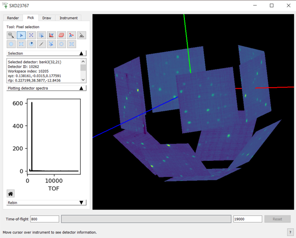

.. _InstrumentViewer:

========================
Instrument Viewer Widget
========================

Overview
--------

The Mantid visualisation system allows users to view the geometry of an instrument and also select and query individual detectors.
An instrument is always shown in the context of a workspace, which contains data recorded with this instrument.
The detectors are colored according to the data in the corresponding spectra of the workspace.
The user can select individual detectors by clicking on them and request to see the data recorded by this detector as a table or a graph.
The instrument view also allows users to see close-ups of any component.

Instrument View Pane
--------------------
The instrument view window can be obtained by right clicking on the workspace of interest and selecting ``Show Instrument``.
A 2D projection of the detector arrangement will be visible with each detector pixel color coded depending on the integrated number of counts in its corresponding spectrum, as in the image below.

.. figure:: ../images/Workbench/InstrumentViewer/Overview.png
    :align: center
    :width: 635

It is possible to alter the view of the instrument by holding down either mouse button and moving (dragging) it within the window.
There are other mouse and key board controls, which are listed at the bottom of the instrument view window.

The control panel of the instrument view has four tabs: ``Render``, ``Pick``, ``Mask``, and ``Instrument``.

.. _instrumentviewer_render_tab:

Render Tab
----------
The Render tab contains controls for managing the on-screen appearance of the instrument and collected data.
The top-most combo-box control allows the user to select the way the instrument is projected onto the screen.
The default setting is ``Full 3D`` which gives a 3D view of the instrument in an orthogonal projection.
The other options are unwrapped views, which project the instrument onto a curved surface and unwrap it onto the view.
There is a choice between cylinders and spheres or a side by side view.

The side by side view identifies flat banks of detectors in the instrument definition by looking for the following component types:

- ``RectangularDetector``
- ``StructuredDetector``
- any component with a set of children or grandchildren having the ``outline`` attribute set to ``yes``. This is interpreted as a bank of tubes
- any component with detector children arranged in a flat surface

Each flat bank is then rotated about one of its corners until the bank surface is parallel to the xy plane and a parallel projection is then made of all the banks onto the xy plane. Finally the banks are spread out to remove any overlap between their projected positions.
The spread is applied by fixing the largest bank and moving all other banks away from it until there are no overlaps.
The bank centres in the side by side view can be overridden using the <side-by-side-view-location> tag in the :ref:`instrument definition file <Side by side view location>`.

The unwrapped (or flat) views allow zooming by selecting a rectangular region with the mouse (left click and drag).
Right-clicking resets the zoom, which shows the entire instrument.

.. figure:: ../images/Workbench/InstrumentViewer/RenderTab.png
    :align: center
    :width: 635

The next control is ``Axis View``, visible only in the 3D mode, which resets the view so that the instrument is fully visible and the specified axis is perpendicular to the screen.

The ``Display Settings`` button controls the appearance of the instrument in the view.
The ``Use OpenGL`` option toggles between two display modes of a flat view: one that uses OpenGL to render the instrument and one that doesn't.

.. figure:: ../images/Workbench/InstrumentViewer/DisplaySettings.png
    :align: center
    :width: 635

This option can be useful if the instrument is viewed over a slow network connection, for example.

The ``Save image`` button allows the image to be save into a file.

The color bar axis below maps the colors of the detectors to the integrated number of counts in their spectra.
The axis also defines the minimum and maximum values, which can be edited using the text boxes below and above the color bar.
Mantid comes with a number of color map files and these can be loaded by selecting the ``Display Settings`` -> ``Color Map``.

.. _instrumentviewer_pick_tab:

Pick Tab
--------
Pick Tab is for displaying information about detectors of an instruments and data collected by them. The parameters defined for each component may be hidden if the attribute 'visible' is specified as false. You can also manipulate the peak markers in this tab.
At the top of the tab there is a tool bar for switching between different interactive tools.
The text box below the tool bar shows textual information about selected detector:

- Name
- ID
- Index in the workspace
- Cartesian coordinates of the detector (xyz) in metres
- Spherical coordinates of the detector (rtp, which stands for r, \theta, and \phi) where the distance is in metres and the angles are in degrees
- The full path of the detector in the instrument tree
- Integrated counts
- The units of the X vector in the underlying workspace.

Single detector selection
#########################

The |singlePixel| tool allows the user to click on detectors, which will update the mini-plot to display the spectrum of the workspace
associated with the clicked detector. The user can keep curves of interest for longer by right clicking on the detector and selecting ``Store curve``
from the context menu.

The context menu also gives the option to save the content of the mini-plot to a new workspace. There is no limit to the number of curves
that can be added to the mini-plot. Curves can be removed by right-clicking on the mini-plot and selecting the line the user wishes to remove. The same
menu allows for switching between linear and log scales for the Y axis.

Tube Selection
##############

The |tubeBank| tool allows the user to click a detector and have the mini-plot display the data from the immediate parent of the
detector. Usually a tube or bank, depending on the instrument.

When using this tool, the user can right-click on the mini-plot to select between a sum of the counts of all detectors in the bank/tube or counts integrated
over the time bins vs the detector position in the tube.

.. |tubeBank| image:: ../images/PickTabPickTubeButton.png

.. figure:: ../images/Workbench/InstrumentViewer/PickTubeContextMenu.png
    :align: center

Create a Single Crystal Peak List
#################################

The |singleCrystal| tool allows the user to create a single crystal peak list and add a peak to it. First, select the tool and click a detector. Then
click on the peak in the mini-plot. If it is the first peak Workbench will create a :ref:`PeaksWorkspace <PeaksWorkspace>` named ``SingleCrystalPeakTable``
and add a peak to it. Peak markers will then be displayed over the instrument.

.. |singleCrystal| image:: ../images/PickTabAddPeakButton.png

.. figure:: ../images/Workbench/InstrumentViewer/SingleCrystalPeakExample.png
    :align: center

Single Crystal Peak Eraser
##########################

The |eraser| tool can be used to remove single crystal peaks by clicking on or dragging over the peak markers. The hatched rectangle indicates the
area where peaks will be erased. The rows in the :ref:`PeaksWorkspace <PeaksWorkspace>` are then deleted with the markers. The size of the rectangle
can be adjusted by scrolling.

Peak Comparison Tool
####################

The |peakComparison| tool can be used to calculate the reciprocal angle between two single crystal peaks. The hatched box indicates the area in which peaks
will be selected. Click on a single peak marker to select it, then again on another marker. There will be a line drawn between the two peaks and the information
box will show the list of peaks falling into this spectrum.

.. |peakComparison| image:: ../images/PickTabCPCompare.png

.. figure:: ../images/Workbench/InstrumentViewer/PeakComparisonExample.png
    :align: center

Peak Alignment Tool
###################

The |peakAlign| tool allows for the calculation of in-plane and out-of-plane angles between a user defined plane and an out-of-plane peak in Q-space. The plane
must be defined first, by selecting two peaks. Clicking while they are within the hatched box will select them, and mark them with a blue circle. Subsequent peaks
will be highlighted by green circles. The information box will contain the in-plane angles (phi) and out-of-plane angles (theta) for each green peak.

Selections can be cleared by right-clicking the instrument view and selecting ``Clear alignment plane``.

.. |peakAlign| image:: ../images/PickTabCPAlign.png

.. figure:: ../images/Workbench/InstrumentViewer/PeaksAlignmentExample.png
    :align: center

.. _instrumentviewer_draw_tab:

Draw Tab
--------

.. |ellipse| image:: ../images/PickTabEllipseButton.png
.. |rectangle| image:: ../images/PickTabRectButton.png
.. |ellipseRing| image:: ../images/PickTabElRingButton.png
.. |rectangleRing| image:: ../images/PickTabRectRingButton.png

.. |arbitrary| image:: ../images/PickTabArbitraryShape.png

The Draw tab contains tools for creating and editing geometrical shapes, which can be used for selecting regions of interest (ROI) or for masking or grouping detectors.
The tab contains a smaller toolbar, a shape property browser, and a set of buttons to create shapes.

Masks are created by using six tools:

- |ellipse| Ellipse
- |rectangle| Rectangle
- |ellipseRing| Ellipse Ring
- |rectangleRing| Rectangle Ring
- |sector| Sector
- |arbitrary| Brush: This allows for drawing of masks arbitrarily. The size of the brush can be changed by scrolling.

There is no limit on the number of shapes. The shapes can be selected and edited by selecting |edit|.
Click on the shaded part of a shape and drag to move it around or move a control point to resize.

.. |edit| image:: ../images/PickTabEditButton.png

.. figure:: ../images/Workbench/InstrumentViewer/DrawShapesExample.jpg
    :align: center

The property browser displays the parameters of the selected shape. All sizes are given in the coordinates of the unwrapped surface the shapes are drawn on.
For example, for a spherical surface it will be polar and azimuth angles in radians. The shapes are "attached" to the surface and move with it when the view is zoomed or moved.
|zoom| can be used to zoom in and out from the render.

.. figure:: ../images/Workbench/InstrumentViewer/DrawPropertyBrowser.png
    :align: center

Using the Drawn Shapes
######################

If the shapes are being used for masking or selecting regions of interest (ROIs) they can be used in two ways:

- To apply the shapes to the workspace press the ``Apply to Data`` button. The shapes will be applied into the underlying workspace and shown in the instrument display.
- To see the effect of applying the changes, but without affecting the underlying workspace, click the ``Apply to View`` button.
  This will change the view you are looking at, but not the underlying data in the workspace. Changes applied in this way can be reverted using ``ClearAll`` button.

Masks and Regions of Interest (ROI's) can also be saved into a separate workspace or into a file, using the options in the ``Apply and Save`` drop-down.

If the ``Group`` option is selected, the selected detectors can be extracted or summed into a workspace using the ``Save`` drop-down.

Bin Masking
###########

When the ``Mask`` option is selected and the integration range is reduced, only bins within the selected range will be masked instead of whole detectors.
The shapes created with the drawing tools now select the detectors for which the bins will be masked.

Clicking the ``Apply bin mask to view`` button will use the :ref:`MaskBins <algm-MaskBins>` algorithm mask the selected bins in the data workspace.

.. figure:: ../images/Workbench/InstrumentViewer/DrawBinMask.png
    :align: center

The ``Apply to Data`` button will apply all defined detector and bin masks using the relevant algorithms.

Instrument Tab
--------------

This contains a list of components and component assemblies as they are named and arranged in the :ref:`Instrument Definition File <InstrumentDefinitionFile>`.
For example, in some instruments the detectors are arranged into banks, in others - a long list.
Clicking on a component moves the view of the instrument to centre on that component.

Python Control
--------------
Many aspects of the instrument view can be controlled from Python.
To use the Python interface for the Instrument Viewer, use the following code to import the necessary libraries:

.. code-block:: python

  from mantidqt.widgets.instrumentview.api import get_instrumentview

Then, load the Nexus data into a workspace:

.. code-block:: python

  ws = LoadEventNexus(Filename=nexus_path, NumberOfBins=10)

Now we are done with the necessary preparations, time to get a handle to the window itself (this will create a fresh window):

.. code-block:: python

  myiv = get_instrumentview(ws)
  myiv.show_view()

To set the integration range (in time-of-flight), use:

.. code-block:: python

  myiv.set_bin_range(1, 10000)

To switch to a different tab, use:

.. code-block:: python

  myiv.select_tab(0)  # TabIndex
                      # 0: Render, 1: Pick, 2: Draw, 3: Instrument

To select the projection type (surface type), use:

.. code-block:: python

  myiv.select_surface_type(0) # SurfaceTypeIndex
                              # 0: FULL3D
                              # 1: CYLINDRICAL_X, 2: CYLINDRICAL_Y, 3: CYLINDRICAL_Z,
                              # 4: SPHERICAL_X,   5: SPHERICAL_Y,   6: SPHERICAL_Z,
                              # 7: SideBySide

To change the option to maintain aspect ratio, use:

.. code-block:: python

   myiv.set_maintain_aspect_ratio(False)

Please note that this command is ignored when the surface type is set to 0 (Full 3D).

To switch to a different viewing axis, use:

.. code-block:: python

  myiv.set_axis("Y+")  # (Z+, Z-, Y+, Y-, X+, X-)

To select the range for the data (intensity, color map legend), use:

.. code-block:: python

  myiv.set_auto_scaling(False)         # need to turn off autoscaling before changing anything
  myiv.set_color_min(1, True)          # minimum value for the colorbar
  myiv.set_color_max(1000, True)       # maximum value for the colorbar
  myiv.set_color_range(1, 1000, True)  # full range of the colorbar
  myiv.set_color_scale(0)              # color legend scale type
                                       # 0: Linear, 1: SymmetricLog10, 2: Power

To start the app outside ``MantidWorkbench``, use the following code snippet as a starting point:

.. code-block:: python

  import sys
  from mantidqt.gui_helper import get_qapplication
  from mantid.simpleapi import LoadEventNexus
  from mantidqt.widgets.instrumentview.api import get_instrumentview
  # check if launched within Workbench, if not return a parent QApp for this widget
  # to attach to
  app, within_mantid = get_qapplication()
  # prepare a valid workspace from any nexus file
  nexus_path = '/SNS/EQSANS/shared/sans-backend/data/new/ornl/sans/hfir/gpsans/CG2_9177.nxs.h5'
  ws = LoadEventNexus(Filename=nexus_path, NumberOfBins=10)
  # setup the instrument view
  myiv = get_instrumentview(ws)
  # to open the app
  myiv.show_view()
  # select tab
  myiv.select_tab(0)
  # select projection (surface type)
  myiv.select_surface_type(0)
  # select axis
  myiv.set_axis("Z-")
  # select the range for the data (intensity, color map legend)
  myiv.set_auto_scaling(False)
  myiv.set_color_min(1, True)
  myiv.set_color_max(1000, True)
  myiv.set_color_range(1, 1000, True)
  myiv.set_color_scale(0)
  # select the integration range (time of flight)
  myiv.set_bin_range(1, 10000)
  # if running as a standalone app, start the QApp
  if not within_mantid:
    myiv.reset_view()
    sys.exit(app.exec_())

NOTE: If the Instrument Viewer is launched outside of Workbench on RHEL_7, the user will need to click on the viewing widget to allow it to render correctly.
For other operating systems, the Instrument Viewer widget should display the instrument properly upon launching.
