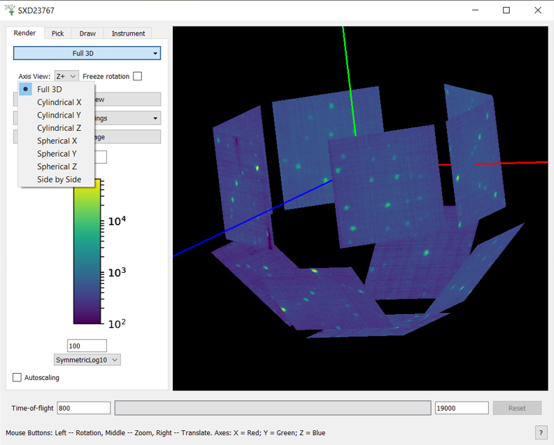

.. _InstrumentViewer:

========================
Instrument Viewer Widget
========================

Overview
--------

Mantid visualisation system allows users to view the geometry of an instrument and also select and query individual detectors.
An instrument is always shown in the context of a workspace containing data recorded with this instrument.
The detectors are coloured according to the data in the corresponding spectra of the workspace.
The user can select individual detectors by clicking on them and request to see the data recorded by this detector as a table or a graph.
The instrument view also allows users to see close-ups of any component.

Instrument View Pane
--------------------
The instrument view window can be obtained by right clicking on the workspace of interest and selecting "Show instrument".
A 2D projection of the detector arrangement will be visible with each detector pixel color coded depending on the integrated number of counts in its corresponding spectrum, as in the image below.

.. figure:: ../images/Workbench/InstrumentViewer/Overview.png
    :align: center
    :width: 635

It is possible to alter the view of the instrument by holding down, either, mouse button and moving (dragging) it within the window.
There are other mouse and key board controls and these are listed at the bottom of the instrument view window.
There are other ways to change the view, find and get information about components and these are described in the next sections.

The control panel of the instrument view has four tabs: Render, Pick, Mask, and Instrument Tree.

Render Tab
----------
The Render tab contains controls for managing the on-screen appearance of the instrument and collected data.
The top-most combo-box control allows the user to select the way the instrument is projected onto the screen.
The default setting is "Full 3D" which gives a 3D view of the instrument in an orthogonal projection.
The other options are "unwrapped views" projecting the instrument onto a curved surface and then unwrapping it onto the screen.
There is a choice between cylinders and spheres.
The unwrapped (or flat) views allow zooming by selecting a rectangular region with the mouse (left click and drag).
Right mouse click undoes the last zoom.

The next control is Axis View, visible only in the 3D mode, which resets the view so that the instrument is fully visible and the specified axis is perpendicular to the screen.

The Display Settings button controls the appearance of the instrument in the view.
It's worth mentioning the "Use OpenGL" option.
It toggles between two display modes of a flat view: the one that uses OpenGL to render the instrument and the one that doesn't.

.. figure:: ../images/Workbench/InstrumentViewer/DisplaySettings.png
    :align: center
    :width: 635

This option can be useful if the instrument is viewed over a slow network connection for example.

The "Save image" button allows the image to be save into a file.

The colour bar axis below maps the colours of the detectors to the integrated number of counts in their spectra.
The axis also defines the minimum and maximum values which can be edited using the text boxes below and above the colour bar and also by clicking on the bar and dragging in the vertical direction.
Clicking and dragging the upper half of the bar changes the maximum while the lower half modifies the minimum.
Mantid comes with a number of color map files and these can be loaded by selecting the "Display Settings"->"Color Map".

Pick Tab
--------
Pick Tab is for displaying information about detectors of an instruments and data collected by them. The parameters defined for each component may be hidden if the attribute 'visible' is specified as false. You can also manipulate the peak markers in this tab.
At the top of the tab there is a tool bar for switching between different interactive tools.
The text box below the tool bar show textual information about selected detector: its name, ID, index in the workspace, cartesian coordinates of the detector (xyz) in metres, spherical coordinates of the detector (rtp, which stands for r, \theta, and \phi) where the distance is in metres and the angles are in degrees, the full path of the detector in the instrument tree, integrated counts, and the units of the X vector in the underlying workspace.

.. figure:: ../images/Workbench/InstrumentViewer/PickTab.png
    :align: center
    :width: 635

Documentation will be updated as additional features are added.

Draw Tab
--------
The Draw tab contains tools for creating and editing geometrical shapes which can be used for selecting regions of interest (ROI), masking or grouping detectors.
The tab contains a mini toolbar, a shape property browser and a set of buttons to use the shapes.

.. figure:: ../images/Workbench/InstrumentViewer/DrawTab.png
    :align: center
    :width: 635

More doc will be migrated from MantidPlot as new features being consolidated.

Python Control
--------------
Many aspects of the instrument view can be controlled from Python.
To use the Python interface for InstrumentViewer, use the following code to import the necessary libraries

.. code-block:: python

  from mantidqt.widgets.instrumentview.api import get_instrumentview

then load the Nexus data into a workspace

.. code-block:: python

  ws = LoadEventNexus(Filename=nexus_path, NumberOfBins=10)

Now we are done with the necesary preparation, time to get a handle to the window itself (this will create a fresh window)

.. code-block:: python

  myiv = get_instrumentview(ws)
  myiv.show_view()

To set the integration range (time-of-flight), use

.. code-block:: python

  myiv.set_bin_range(1, 10000)

To switch to a different tab, use

.. code-block:: python

  myiv.select_tab(0)  # TabIndex
                      # 0: Render, 1: Pick, 2: Draw, 3: Instrument

To select the projection type (surface type), use

.. code-block:: python

  myiv.select_surface_type(0) # SurfaceTypeIndex
                              # 0: FULL3D
                              # 1: CYLINDRICAL_X, 2: CYLINDRICAL_Y, 3: CYLINDRICAL_Z,
                              # 4: SPHERICAL_X,   5: SPHERICAL_Y,   6: SPHERICAL_Z,
                              # 7: SideBySide

To switch to a different viewing axis, use

.. code-block:: python

  myiv.set_axis("Y+")  # (Z+, Z-, Y+, Y-, X+, X-)

To select the range for the data (intensity, color map legend), use

.. code-block:: python

  myiv.set_auto_scaling(False)         # need to turn off autoscaling before changing anything
  myiv.set_color_min(1, True)          # minimum value for the colorbar
  myiv.set_color_max(1000, True)       # maximum value for the colorbar
  myiv.set_color_range(1, 1000, True)  # full range of the colorbar
  myiv.set_color_scale(0)              # color legend scale type
                                       # 0: Linear, 1: SymmetricLog10, 2: Power

To start the app outside ``MantidWorkbench``, use the following code snippet as a starting point

.. code-block:: python

  import sys
  from mantidqt.gui_helper import get_qapplication
  from mantid.simpleapi import LoadEventNexus
  from mantidqt.widgets.instrumentview.api import get_instrumentview
  # check if launched within Workbench, if not return a parent QApp for this widget
  # to attach to
  app, within_mantid = get_qapplication()
  # prepare a valid workspace from any nexus file
  nexus_path = '/SNS/EQSANS/shared/sans-backend/data/new/ornl/sans/hfir/gpsans/CG2_9177.nxs.h5'
  ws = LoadEventNexus(Filename=nexus_path, NumberOfBins=10)
  # setup the instrument view
  myiv = get_instrumentview(ws)
  # to open the app
  myiv.show_view()
  # select tab
  myiv.select_tab(0)
  # select projection (surface type)
  myiv.select_surface_type(0)
  # select axis
  myiv.set_axis("Z-")
  # select the range for the data (intensity, color map legend)
  myiv.set_auto_scaling(False)
  myiv.set_color_min(1, True)
  myiv.set_color_max(1000, True)
  myiv.set_color_range(1, 1000, True)
  myiv.set_color_scale(0)
  # select the integration range (time of flight)
  myiv.set_bin_range(1, 10000)
  # if running as a standalone app, start the QApp
  if not within_mantid:
    myiv.reset_view()
    sys.exit(app.exec_())

NOTE: If the instrument view app is launched outside ``MantidWorkbench`` on RHEL_7, the user need click on the viewing widget to get it rendered properly.
For other OS, the instrument viewing widget should display the instrument properly upon launching.
