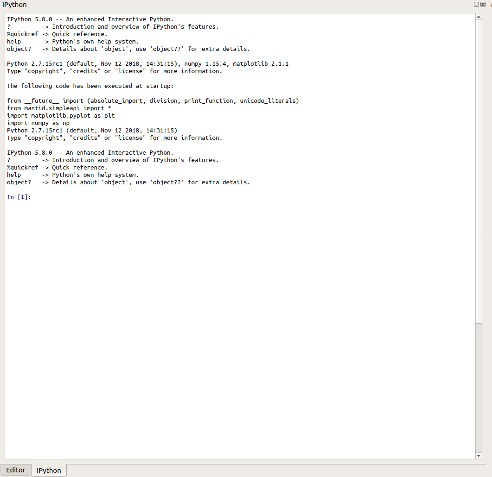

.. _WorkbenchIPythonConsole:

===============
IPython Console
===============

This is a python interpreter which has access to the Mantid API and can
interface with the rest of the Workbench. Through the interpreter it is
possible to interact with Workbench's algorithms, workspaces and plots. It
allows you to manipulate things much like the script window can, but in an
interpreter style: simply type some code and press Return to run it. For more
information on IPython the docs are available
`here <https://ipython.readthedocs.io/en/5.x/overview.html>`_.

Keyboard Shortcuts
^^^^^^^^^^^^^^^^^^
- :code:`Ctrl++` - increase font size.
- :code:`Ctrl+-` - decrease font size.
- :code:`Ctrl+0` - reset font size.
