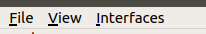
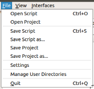
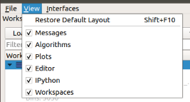

.. _WorkbenchMainWindowMenu:

=================
Main window menus
=================

In Workbench's main window, you may notice a few options in the upper
left hand corner. From here you can access drop down menus that give access to
options to do things such as change settings, save scripts and projects,
change the layout and more.

File Menu
---------

From the File menu you have access to standard options such as load (Open) and
save for your current :ref:`project <Project>` or scripts open in the
:ref:`script window <WorkbenchScriptWindow>`. You can also access the Workbench
settings, from which you can choose your facility and
:ref:`instrument <Instrument>`. There are also options to manage your user
directories or close the Workbench.

The manage user directory dialogue, is useful for allowing search of the
archive using the load algorithm and other parts of mantid that rely on the
file finder.

View Menu
---------

From this menu, it is possible to access the various options to change what
does and doesn't appear on Workbench. It is also possible to restore default
positions of all parts of the workbench GUI back to their defaults.

Interfaces Menu
---------------

From here you can access all of the :ref:`interfaces contents` available to
Mantid Workbench.
