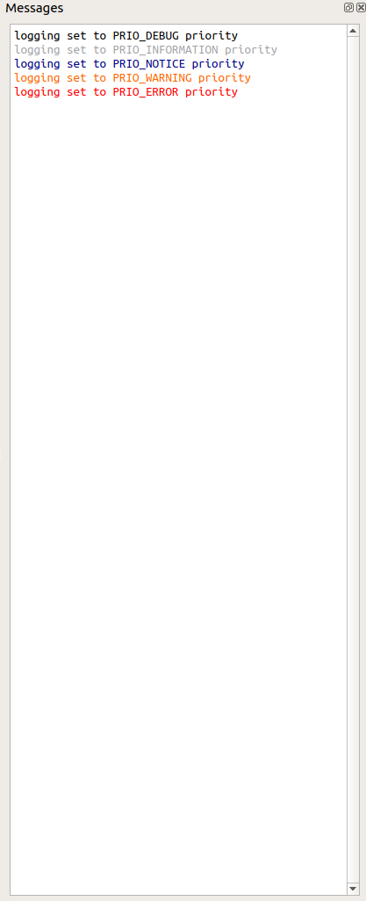

.. _WorkbenchMessagesWindow:

===============
Messages Window
===============

All of the output from your scripts and algorithms run from interfaces or
other places will be output here. This is alongside the ability change the
logging level. The logging level has 5 different options to display the right
level of detail to choose the correct amount of detail for your circumstances.

All output from running your scripts or Mantid algorithms is logged in
this window. To minimise the amount of information displayed in this window you
are provided with 5 logging levels (in ascending order of priority):

    - Debug
    - Information
    - Notice
    - Warning
    - Error

To select your logging level right-click inside the message window.

.. image:: ../images/Workbench/MessageWindow/MessagesWidgetContextMenu.png

Any log message with a priority higher or equal to the selected level will be
displayed. To distinguish between priority levels each one has an associated
colour, as shown in the figure on the right.

