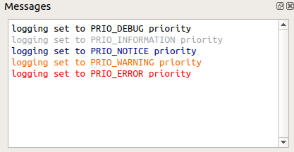
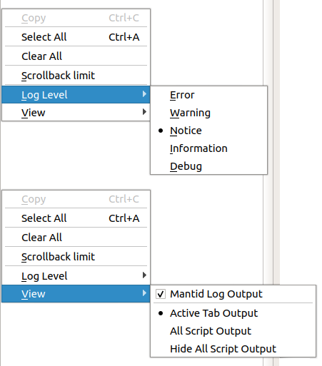

.. _WorkbenchMessagesWindow:

===============
Messages Window
===============

Output from the scripts and algorithms you have run will be logged here,
alongside any notices outputted by the Workbench. So that only the information
most relevant to you is displayed, you are provided with 5 logging levels (in
ascending order of priority):

- Debug:
      For debugging purposes. Anything that may be useful to understand
      what Mantid's code has been doing. Mostly used by developers or by
      users reporting issues.
- Information:
      Useful information. Used by users who want more detail regarding
      Mantid's status.
- Notice:
      Important updates about Mantid's status. Algorithms log at this level
      when starting/finishing. This is the default logging level.
- Warning:
      Something was wrong but Mantid was able to continue despite the
      problem.
- Error:
      An error has occurred but Mantid is able to handle it and continue.

Any log message with a priority higher or equal to the selected level will be
displayed. To distinguish between priority levels each one has an associated
colour, as shown in the top-right figure.

To further filter what log messages are displayed, you are given the
options to:

- Hide or show Mantid log output:
    These are messages outputted by Mantid e.g. from inbuilt algorithms
- **Output from the currently open script, or**
- **Output from all scripts, or**
- **Hide output from all scripts**

Any warnings or error messages will always be displayed once, regardless of
filtering settings.

To select your logging level and set your filtering settings, right-click
inside the message window.

