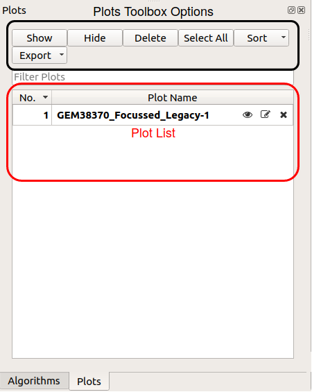
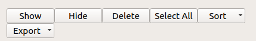
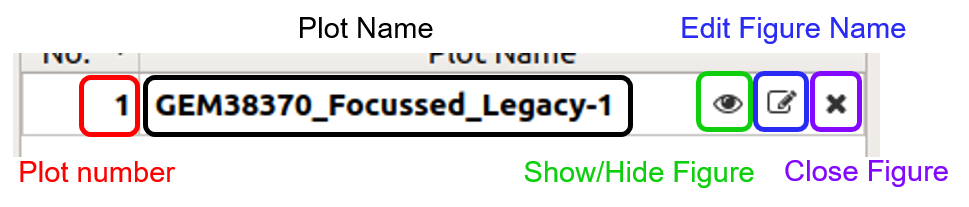

.. _WorkbenchPlotsToolbox:

=============
Plots Toolbox
=============

This is a new concept in Mantid applications, the plots toolbox will encompass
and display all currently open plots much like the workspace toolbox. It has
options to hide, delete, or edit the name of each plot. All this can be done
using the options buttons on top of the toolbox.

Plots Toolbox Options
---------------------

The toolbox options give you an easy way to interact with your plots in the
workbench. There are options to show, hide or delete the selected figure and
you can use the "Export" option to save a figure or figures in several
different formats. To make navigating the Plots Toolbox easy you can sort your
plots by name, number or most recently active, or use the "Filter Plots" bar to
to do a search.

Plots List
----------

On each plot list item there are three buttons: "Show/Hide Figure",
"Edit Figure Name" and "Close Figure". You can toggle the visibility of a plot
using the "Show/Hide Figure" button. The "Edit Plot Name" option allows you to
change the name of the figure in the plot list. The "Close Figure" option will
delete the figure and remove it from the plot list, *you cannot recover the
figure after selecting this*.
