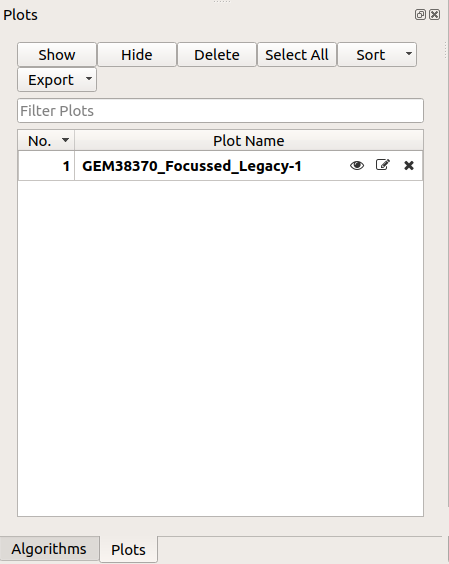

.. _WorkbenchPlotsToolbox:

=============
Plots Toolbox
=============

This is a new concept in Mantid applications, the plots toolbox will encompass and display all currently shown plots
much like the workspace toolbox. It has the option to hide, remove, and edit the name of each plot individually. All
this can be done from the buttons on top of the toolbox which will allow you to perform operations on multiple plots
at once, showing, hiding and more with the click of a button.

.. image:: ../images/Workbench/PlotToolbox/PlotsToolboxDiagram.png

Plots Toolbox Options
---------------------

.. image:: ../images/Workbench/PlotToolbox/PlotsToolboxOptions.png

Plots List
----------

# Make this image a diagram highlighting each button as this is new to all users extra explanation may be needed
