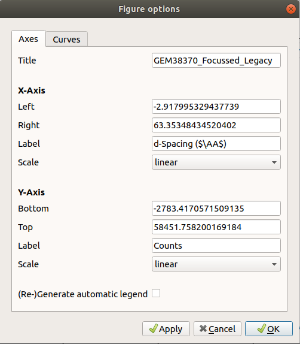
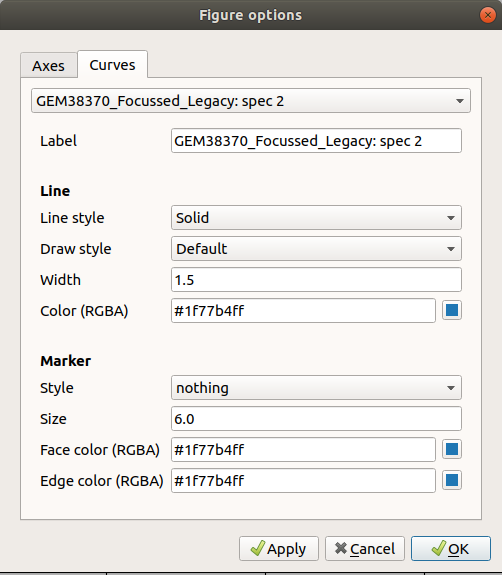

.. _WorkbenchPlotWindow:

==================
Workbench Plotting
==================
This is the window in which all plots will be shown. There are many things that are possible from this window with
regards to adjusting including the plot, saving/exporting and fitting the curves.

In Mantid Workbench, the old plotting from MantidPlot has been replaced by the Matplotlib python library. It has been
integrated seamlessly into the interface to work the same way as the previous method alongside some added benefits such
as the extra customisation and improved plotting window. Matplotlib has very high customisation, via scripting and has
some functionality exposed via the new plotting window's settings.

.. image:: ../images/Workbench/PlotWindow/PlotWindow.png

Plot Window Context Menu
------------------------

.. image:: ../images/Workbench/PlotWindow/PlotWindowContextMenu.png

Plotting Options
-------------------

Two tabs:

# Mention the rcParams document made by keeto on github and finish PR if necessary.

Fitting
-------

.. image:: ../images/Workbench/PlotWindow/FitPlotWindow.png