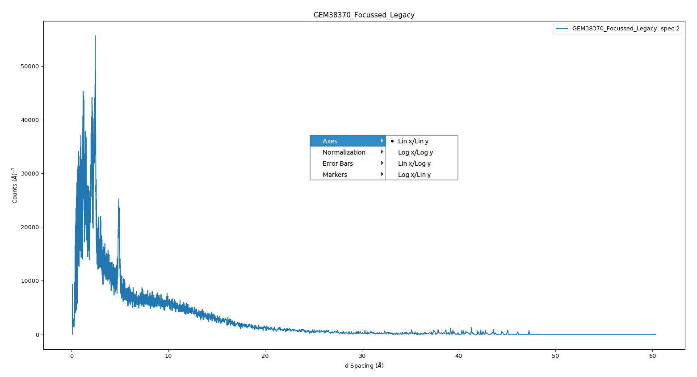
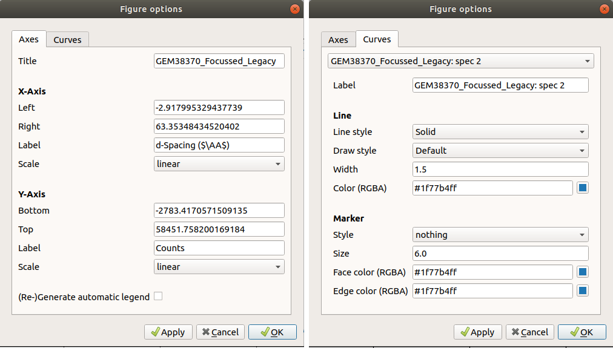

.. _WorkbenchPlotWindow:

==================
Workbench Plotting
==================

.. image:: ../images/Workbench/PlotWindow/PlotWindow.png
    :align: right
    :scale: 60%

This is the window in which all plots will be shown. Within this window you can
view, save, and edit your plots as well as fit functions to your plots using
the fitting interactive tool.

Plotting in Workbench is carried out using Python's Matplotlib package.
Matplotlib provides several advantages: it is a large library containing
many features, it is also widely used which means there is excellent
documentation available and plenty of examples to work from. You can create a
plot either using Matplotlib within your scripts or right-clicking a workspace
and selecting to plot.

For more help using Matplotlib within Mantid you can read the
:ref:`Introduction to Matplotlib in Mantid <plotting>`.

Plot Window Context Menu
------------------------

Right-clicking within your plot will open the plot context menu. From this menu
you can set the axes' scales to linear or logarithmic.

Figure Options
-------------------

Selecting the settings icon in the plot window brings up the figure options
window. There are two tabs within this window: axes options and curve options.

In the "Axes" tab you can change the figure's title, the axes limits and scale
and change the axes labels. There is also the "(Re-)Generate automatic legend"
tick box at the bottom, make sure this is ticked if you want to update your
legend.

In the "Curves" tab you can change the properties of curves within your figure.
The drop down menu at the top gives a list of the curves present in the figure,
you can select the curve you want to modify. From here you can change the style
and colour of the curve, as well as add point markers and change its
label. To make sure the legend is updated ensure you have ticked the
"(Re-)Generate automatic legend" box on the "Axes" tab.

You can set default settings using Matplotlib's :code:`rcParams` for a guide to
this see :ref:`Change Matplotlib Defaults <mplDefaults>`.

Fitting
-------

.. image:: ../images/Workbench/PlotWindow/FitPlotWindow.png
    :scale: 60%

The "Fit" option in the plot window toolbar activates the interactive fitting
tool. From here you can add functions to fit to, choose the bounds to fit
within and choose a fitting algorithm. For more on fitting see
:ref:`fitting contents`.
