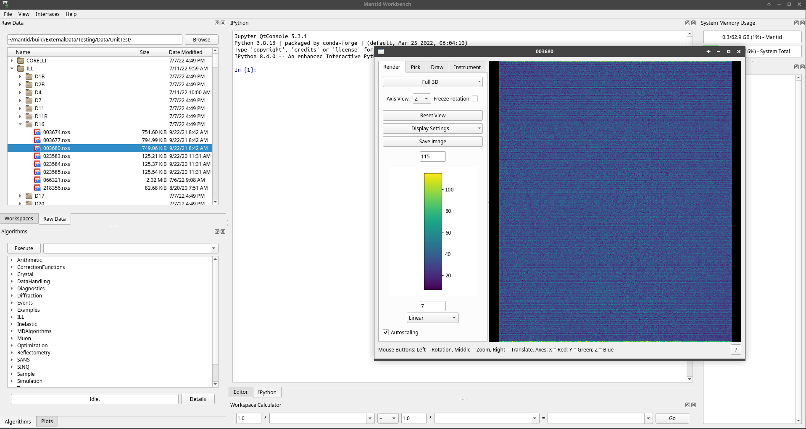

.. _RawDataExplorer:

=================
Raw Data Explorer
=================

The raw data explorer allows to quickly browse raw data and display it in the most appropriate widget.
It is meant for fast exploration of an important quantity of data.

It is located tiled under the workspace manager widget.

The root directory can be selected by either directly typing the path in the editable line or browsing through it via the button.
It is also possible to navigate by clicking on the directories in the tree.

To open a file, one just need to click on it, or to move using the keyboard arrow keys.
If a preview is already opened, it will be closed or replaced to show this new workspace.

Accumulate mode
---------------

One can also accumulate the values by keeping the `Ctrl` key pressed and clicking on files of interest.
As long as they can be added, the values will be accumulated in a workspace and shown in the preview.
It is not possible to remove a file from the accumulation, one must start another sum.

Memory management
-----------------

In order to shorten loading times and make the user experience more pleasant, the raw data explorer does not delete the
workspaces it has loaded, so they can be immediately reused if the user needs them again. This also means that if these
workspaces are modified (for example if the user masks some pixels in the instrument viewer and saves to workspace),
the modification will appear again when the user comes back to the file.

Because of this caching behaviour, the raw data explorer could consume a lot of memory on prolonged use, since a lot of
data could end up being loaded as the user browses through its files. In order for that not to become an issue,
the raw data explorer keeps track of what it loaded, when, and how much memory is currently in use, and if necessary will
delete the workspaces with which the user interacted the longest ago.