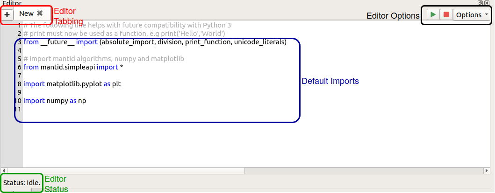
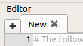
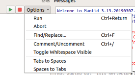
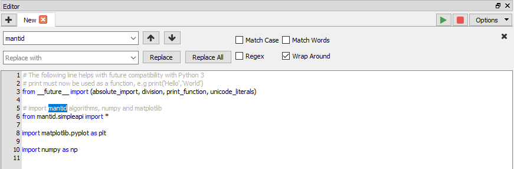
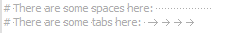
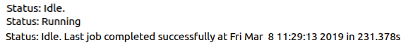

.. _WorkbenchScriptWindow:

=======================
Workbench Script Window
=======================

The script window is another key part of the Workbench. The script window is
used to write or load python scripts that integrate with the Mantid framework
and operate on data loaded within the Workbench. The window contains a status
bar, multiple tabs for scripts, run and abort buttons and an options menu.

Editor Tabbing
---------------

Click the **+** button to open a new tab, or if you wish to open an existing
script in a new tab, go to "File" -> "Open Script" (or use the :code:`Ctrl+O`
keyboard shortcut). When opening the Workbench any script window tabs that were
open last time it was closed will be restored.

Editor Options
--------------

Run and Abort
^^^^^^^^^^^^^
There are buttons to run and abort the current script, or alternatively you can
use the shortcut :code:`Ctrl+Return` to run the script. If a section of a
script is selected then only the selection will be run, if nothing is selected
the whole script will be run. A shortcut to run the full script, regardless of
selection, is :code:`Ctrl+Shift+Return`.

Find and Replace
^^^^^^^^^^^^^^^^

There is a useful find and replace window that can make navigating your scripts
much easier. You can search for exact words, make your search case sensitive
or even use regular expressions
(`Regex <https://www.petefreitag.com/cheatsheets/regex/>`_).

Comment and Uncomment
^^^^^^^^^^^^^^^^^^^^^
Commenting and uncommenting code is a useful tool for any script writer. To use
this, select some lines you wish to comment and click the "Comment/Uncomment"
option (or use the :code:`Ctrl+/` shortcut). To uncomment, select some
commented lines and click :code:`Ctrl+/`.

Toggle Whitespace Visible
^^^^^^^^^^^^^^^^^^^^^^^^^

Whitespace is an important part of the Python language and seeing how many
spaces you have in your indentations can be useful. When whitespace is set to
visible a space will be represented by a small dot and tabs by an arrow. This
option will apply to all tabs.

Toggle Tabs and Spaces
^^^^^^^^^^^^^^^^^^^^^^
Python is very particular about mixing tabs and spaces within your scripts. To
avoid any problems with the Python interpreter an option is provided to convert
all tabs to spaces or all groups of 4 consecutive spaces to tabs. If some text
within a script is selected, these options will only apply within the selected
region.

Default Imports
---------------
By default any new scripts within the window include some imports that are
useful in the Workbench.

The first import is::

    from __future__ import (absolute_import, division, print_function, unicode_literals)

This provides some compatibility between scripts that are written in Python 2
and scripts written in Python 3. Notably all print statements must now use
braces.

The second::

    from mantid.simpleapi import *

This provides access to Mantid's set of algorithms from within the your scripts.

Finally::

    import matplotlib.pyplot as plt
    import numpy as np

Workbench's plotting is all done through `Matplotlib <https://matplotlib.org/>`_
which provides a wide range of plotting tools and a large user community and
therefore excellent documentation and support. For an overview of using
Matplotlib with Mantid see
:ref:`Introduction to Matplotlib in Mantid <plotting>`.

`NumPy <https://docs.scipy.org/doc/numpy/user/quickstart.html>`_ is
ubiquitous within scientific computing in Python and its data structures can be
used within Mantid. For a short introduction to NumPy see Mantid's
`Numpy Introduction <https://www.mantidproject.org/Numpy_Introduction>`__.

Editor Status
-------------

The editor window's status bar gives the current state of the Python
interpreter. It will tell you if there is a script currently running, or if the
interpreter is idle. It will also inform you of when the last script was
executed and whether it was executed successfully or if there were errors.

