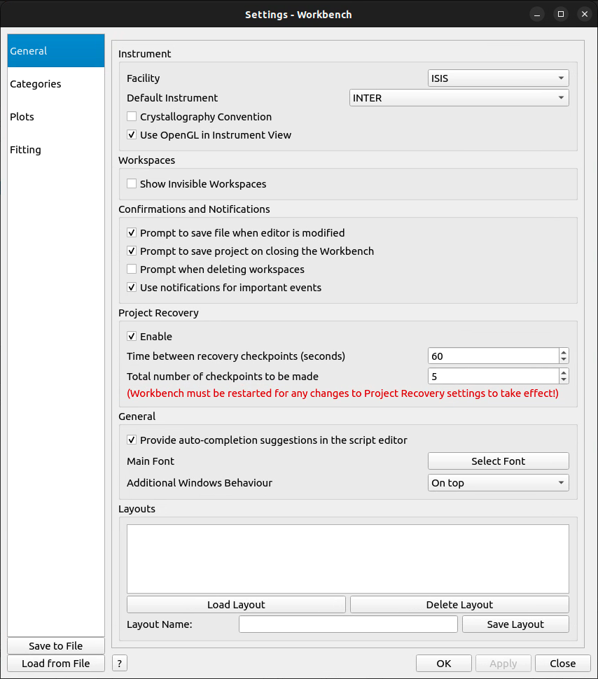
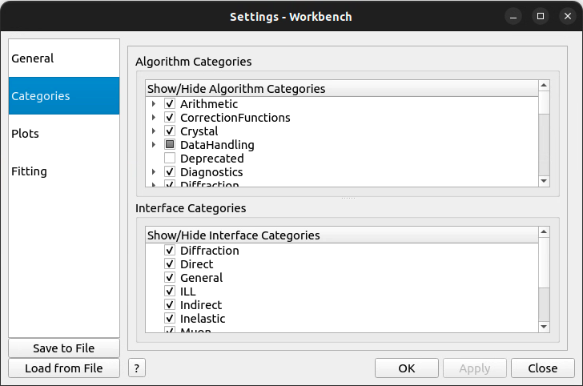
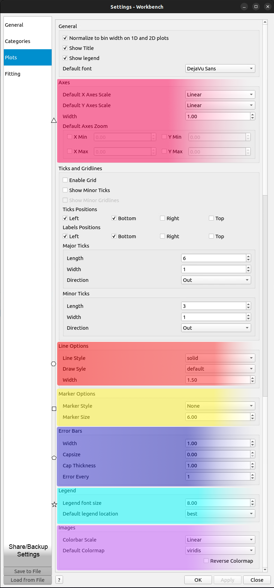

.. _WorkbenchSettings:

========
Settings
========

The settings menu in workbench can be used to change your personal user defaults
and modify some of the functionality of workbench.

General
=======

- Facility and Default Instrument: These settings control the default settings used
  for Mantid interfaces that require a facility or instrument. This can be set outside
  of settings by changing the instrument in other interfaces, such as
  `Muon Analysis 2 <Muon_Analysis-ref>`_.
- Workspaces: This controls the visibility of workspaces whose names begin with ``__``.
- Confirmations and Notifications: These settings enable and disable confirmation boxes to save scripts
  and projects and error notifications.
- Project Recovery: These settings enable project recovery in case of a crash (recommended).
- Main Font: Edit the font type and size used for all of Workbench, except for the script editor and messages box.
- Additional Window Behavior: This setting controls the behavior of additional windows in Workbench.
  When it is set to ontop, additional windows such as plot will be kept ontop of the workbench main window.
  For further details of this setting, such as OS specific behavior, see :ref:`Window Behavior <WorkbenchWindowBehavior>`.
- Layouts: You can save and load layouts from this area. Save layout will save the current
  arrangement of widgets in the main window that can be loaded using load layout.

|
|
|

Categories
==========

- Choose which Algorithm categories to show in the Algorithm Toolbox.
- Choose which Interface categories to show in the Interfaces menu.

|
|
|
|
|

Plots
=====

- General: Choose whether to plot workspaces normalised by their bin width, whether to show their title, and whether to show minor ticks and gridlines.
- Axes: Should the Axes on plots be linear or logarithmic?
- Line: Choose a line style and width.
- Marker: Choose a default marker for plots, such as 'point'.
- Error Bars: Control the error bars, such as by setting Capsize > 0, or displaying the Error Every 5 data points.
- Legend: Set the default location for legends in plots.
- Images: Set the default colormap for image plots.

For more information, see :ref:`06_formatting_plots`

There are even a few Fitting options you can set, such as your Default peak / background function.

.. figure:: /images/SettingsFitting.png
   :scale: 60%
   :align: right
   :alt: SettingsFitting

|
|
|

Fitting
=======

- Set your own default background and peak functions
- Control the initial FindPeaks values
