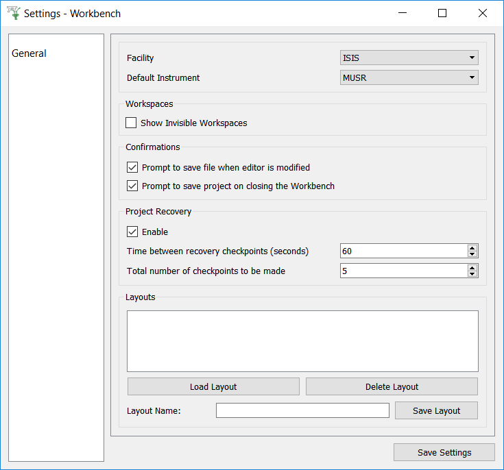

.. _WorkbenchSettings:

========
Settings
========

The settings menu in workbench can be used to change your personal user defaults
and modify some of the functionality of workbench.

General
=======

The general tab contains settings covering general user preferences.

- Facility and default Instrument: These settings control the default settings used
  for Mantid interfaces that require a facility or instrument. This can be set outside
  of settings by changing the instroment in other interfaces, such as
  `Muon Analysis 2 <MuonAnalysis_2-ref>`_.
- Workspaces: This controls the viability of workspaces whose names begin with ``__``.
- Confirmations: These settings enable and disable confirmation boxes to save scripts
  and projects.
- Project Recovery: These settings enable project recovery in case of a crash (recommended)
- Layouts: You can save and load layouts from this area. Save layout will save the current
  arrangement of widgets in the main window that can be loaded using load layout.