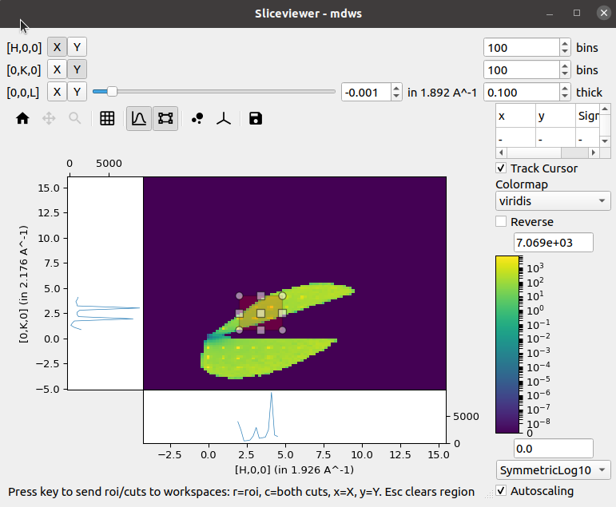
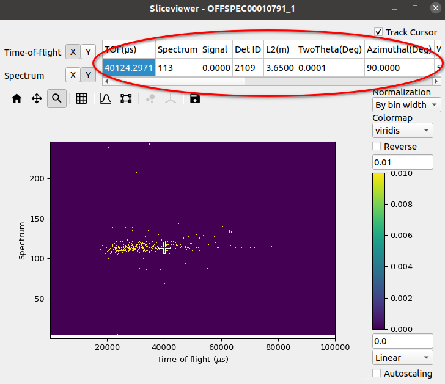

.. _sliceviewer:

===========
Sliceviewer
===========

.. contents:: Table of Contents
   :local:

Overview
--------

The Sliceviewer is a viewer supporting :ref:`MDEventWorkspace <MDWorkspace>`, :ref:`MDHistoWorkspace <MDWorkspace>` & :ref:`MatrixWorkspace`.
For multi-dimensional workspaces, you can view both MDWorkspaces and MDHistoWorkspaces, a 2D "slice" of the higher dimensional space
is shown, whereas a MarixWorkspace simply shows the 2 defined dimensions.

Some of the key features of the Sliceviewer provided are:

- Overlay of peaks workspaces
- Non-orthogonal axes view mode, including peaks workspace overlays
- ROI preview and extraction
- Cursor information widget that, for a MatrixWorkspace, includes quantities such as :math:`l1, l2, 2\theta` etc
- Arrow keys can now be used to move the cursor a pixel at a time when single-pixel line plots are enabled

The following sections illustrate some of these key features.

.. _sliceviewer_peaks_overlay:

PeaksWorkspace Overlay
----------------------

The peaks overlay button allows selection of one or more PeaksWorkspaces to display on top of the main data image.
This is only enabled for MD workspaces.

.. figure:: ../images/wb-sliceviewer51-peaksbutton.png
   :class: screenshot
   :align: center

Peaks are displayed at the locations defined by each peak center
with an 'x', while optionally displaying any peak shape if a given peak has
been integrated.

.. figure:: ../images/wb-sliceviewer51-peaksoverlay.png
   :class: screenshot
   :width: 75%
   :align: center

Adding or removing peaks
~~~~~~~~~~~~~~~~~~~~~~~~

Peaks can be added or removed from an overlayed peaks workspace by
selecting the desired peaks workspace from the drop down box and
selected either ``Add Peaks`` or ``Remove Peaks``, then clicking on
the plot.

.. figure:: ../images/wb-sliceviewer52-peaks-actions.png
   :class: screenshot
   :align: center

When adding peaks the position selected with the mouse click and the
sliders are used, along with the MD Frame (Q_lab, Q_sample, HKL) to
create and add a peak to the peaks workspace. If units are HKL then
the peaks workspace requires an orientated lattice to be defined on
it, one can be copied from the data workspace with :ref:`CopySample
<algm-CopySample>` or can be set with :ref:`SetUB <algm-SetUB>`..

When removing peaks, the closest peak to the position selected will be
removed from the peaks workspace.

Non-Orthogonal Axes View
------------------------

If the units of an MDWorkspace are HKL and the workspace has an attached
UB matrix then the option to display the image using axes aligned with the
crystal (so-called non-orthogonal view) will be now be visible:

.. figure:: ../images/wb-sliceviewer51-nonorthobutton.png
   :class: screenshot
   :align: center

Activating this option transforms the axes taking into account the lattice
angles encoded by the UB matrix:

.. figure:: ../images/wb-sliceviewer51-nonorthogonal.png
   :class: screenshot
   :width: 75%
   :align: center

ROI Preview & Extraction
------------------------

In addition to the single-pixel line plots that were present in the previous release,
a new tool to allow selection of a rectangular region of interest has been added:

.. figure:: ../images/wb-sliceviewer51-roibutton.png
   :class: screenshot
   :align: center

Selecting this tool enables the line plots attached to the image axes but instead of
the line plots being the sum over a single pixel in the orthogonal direction the sum
is now limited to the selected region:

A new status bar has been added at the bottom to indicate that the cuts can be extracted
to separate workspaces by using the relevant keys. Similar keys and status information is
presented in the single-pixel line plots mode.

.. _sliceviewer_cursor:

Cursor Information Widget
-------------------------

The revamped Sliceviewer has merged several features from the SpectrumViewer
in MantidPlot. One of these new features is the ability to show information
regarding a given pixel as the mouse cursor moves of the image. The new table
shows the following quantities for a MatrixWorkspace:

- Signal
- Spectrum Number
- Detector ID
- Two Theta
- Azimuthal angle
- Time-of-flight
- Wavelength
- Energy
- dSpacing
- \|Q\|

and for an MDWorkspace:

- Signal
- x
- y

.. figure:: ../images/wb-sliceviewer51-cursorinfo-md.png
   :class: screenshot
   :width: 75%
   :align: center

Underneath the cursor there is a checkbox labelled ``Track Cursor``.
When checked, the information in the table is updated as the cursor moves
around the image. If unchecked, the information within the table is updated
only when the left-mouse button is clicked within the image.
