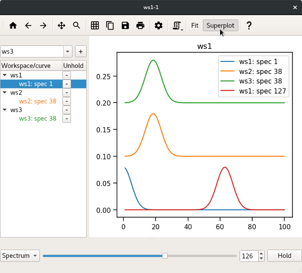

.. _WorkbenchSuperplot:

=========
Superplot
=========

Superplot is a decorator widget of the plot window. It facilitates over-plotting
and manipulation of overplotted data. The superplot is accessible:

* Directly in the toolbar of the the plot window
* In the context menu of supported workspaces, in the submenu "Plot"

**Widget description**

The superplot widget is composed of two distinct parts:

* Left side of the plot window: a list of selected workspaces and spectra. This
  list contains workspaces names and under them the plotted data if any.
* Bottom of the plot: a navigation bar that contains a slider and different
  buttons to navigate through the bins/spectra and control the plotted data.

**Usage**

When the superplot is activated, its state is updated based on the current plot.
The list will contain the names of the selected workspaces and below each of
them, the plotted bins/spectra. One can then add a workspace in the list by
dragging and dropping it in the list or by using the combobox.

By using the dedicated checkbox above this list, one can toggle the activation
of the normalisation (by the maximum value) of the curves.

When one or many workspace(s) is(are) clicked in the list, the navigation bar
can be used to slide over the bins/spectra and update the plot accordingly. The
current curve indicated by the slider for the workspace(s) that is(are) selected
from the list is plotted, but not persisted. If needed, one can click "Add" to
persist a curve on the plot.

Once persisted, the curve(s) is(are) added to the list on the left side. To
delete a curve, one can use its delete button from the list or slide to the
specific position and release press the "Remove" button.

Note that for the raw data, the legend shows the spectrum number, whereas the
navigation bar refers to the workspace index. The index always starts from 0 and
is contiguous, whereas the spectrum number starts from 1 and might not be
contiguous. So for raw data the index indicated in the spinbox will often be 1
less than the spectrum number in the legend/workspace list.
