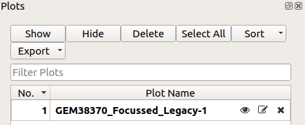

.. _WorkbenchWhatIsNew:

=========================
What is new in workbench?
=========================

.. image:: ../images/Workbench/WorkbenchOverview.png
    :width: 500
    :align: right

Workbench is a completely new Application that has been crafted to utilise the
Mantid API. Between MantidPlot and Mantid Workbench there are some very
noticeable and key differences. These changes will be beneficial to users and
make it easier for people to use Mantid applications and understand how these
applications work.

.. |break| raw:: html

     

New Additions in Workbench:
    * **The new** :ref:`WorkbenchPlotsToolbox` - This new tool allows users to
      work
      effectively with lots of plots; manipulating, viewing and more from a
      dedicated part of Workbench. This alongside all plots being their open
      separate window on all operating systems, having large numbers of plots
      has never been easier. |break| |plottoolboxsmallerview|
    * **Simplified settings and main window features** - The aim was to make it
      easier for users to start using Mantid by removing excess features from
      the toolbars and menus.
    * **No confusion between direct Mantid functionality and QtiPlot
      functionality** - This is due to removing QtiPlot and building a new GUI
      from the ground up to limit confusion.
    * **Localised window buttons and options** - Options and settings that
      apply only to certain features are now located within those features:

      * :ref:`WorkbenchScriptWindow` - The newly integrated script window
        comes with an improved UI, allowing easier running, aborting, and
        access to further options |editoroptionsbuttons|
      * :ref:`WorkbenchPlotWindow` via Matplotlib - The new plot window is a
        self contained, do it all, window. The toolbar contains all controls to
        customise plots and fit curves. |break| |plotstoolbar|

    .. image:: ../images/Workbench/PlotWindow/FitPlotWindow.png
        :align: right
        :width: 500

    * **Much better searching in the** :ref:`WorkbenchAlgorithmToolbox` - Previously in
      MantidPlot you could only search if you knew the full algorithm name.
      This has now changed to make it easier to search for algorithms, by
      allowing users to put in part of the algorithm name.
    * **Ability to restore default layout on workbench** - Customising your
      workspace is common among users and developers alike so with that in mind
      it is now easier to undo any changes and reset it to the default using
      the "View" menu in the :ref:`WorkbenchMainWindowMenu`, or with the
      shortcut :code:`Shift+F10`.
    * **Moved Workspaces and Algorithms toolbox to left side** - In most
      applications, elements of the GUI similar to the
      :ref:`WorkbenchWorkspaceToolbox` and :ref:`WorkbenchAlgorithmToolbox` are
      usually on the left-hand side of the window.
