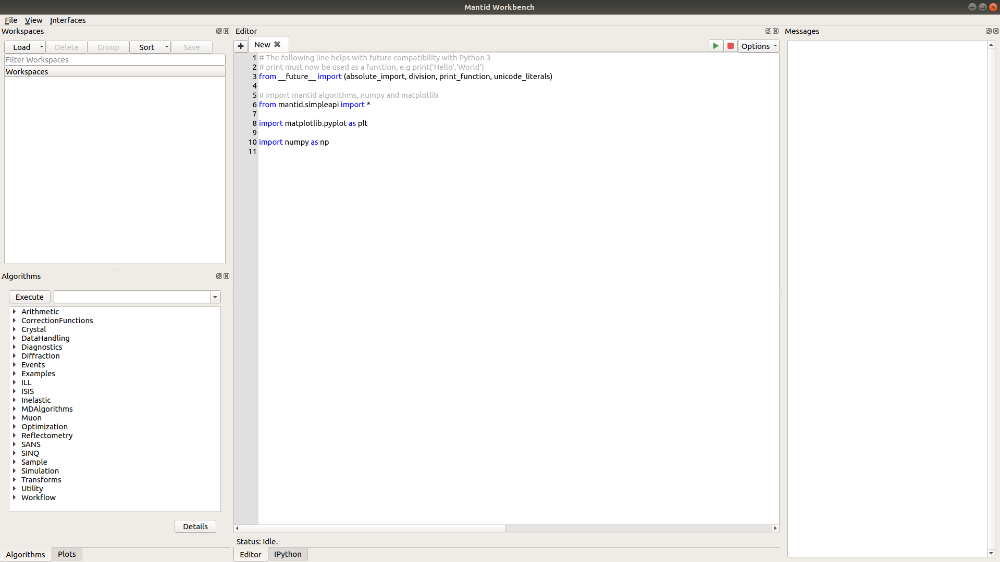
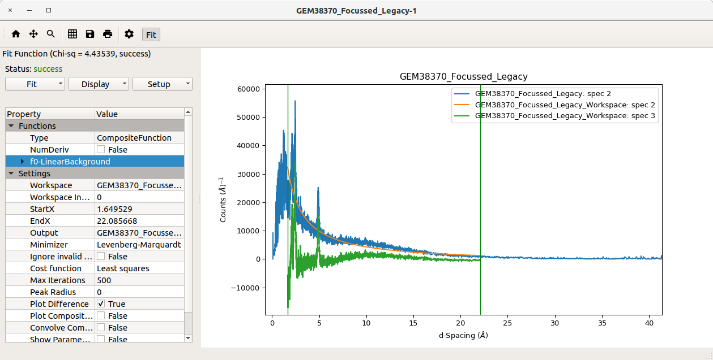

.. _WorkbenchWhatIsNew:

=========================
What is new in workbench?
=========================
Workbench is a completely new Application that has been crafted to utilise the Mantid API, this includes a new GUI and
many new features to improve user experience and usability. Between MantidPlot and Mantid Workbench there are some very
noticeable and key differences. These changes will be beneficial to users and make it easier for people to use Mantid
applications and understand how these applications work.

New Workbench GUI:

.. |plotstoolbar| image:: ../images/Workbench/PlotWindow/PlotWindowPlotToolBar.png

.. |plottoolboxsmallerview| image:: ../images/Workbench/PlotToolbox/PlotToolboxSmallerView.png
    :scale: 70%

.. |break| raw:: html

     

New Additions in Workbench:
    * :ref:`WorkbenchPlotsToolbox` - This new tool allows users to work effectively with lots of plots, manipulating, viewing and more from a dedicated part of Workbench. |break| |plottoolboxsmallerview|
    * Simplified settings and main window features - The aim was to make it easier for users to start using Mantid, by removing excess features from the toolbars and menus.
    * No confusion between direct mantid functionality and QtiPlot functionality - This is due to removing any reference to QtiPlot and building a new GUI from the ground up, this will limit confusion.
    * Moved controls closer to the thing being interacted with, for:
        * :ref:`WorkbenchScriptWindow` - The newly integrated script window comes with button to adjust settings, run the script, and abort |editoroptionsbuttons|
        * :ref:`WorkbenchPlotWindow` - In the new plot window, it is a self contained, do it all window, it contains all plot controls, customisation and fitting, all in one detached window for user ease of use, using this handy toolbar: |plotstoolbar|
    * :ref:`WorkbenchPlotWindow` via Matplotlib - This is a new plot window that has incorporated a great toolbar, a fitting browser, and plot manipulation. |fitplotwindow|
    * Much better algorithm searching in toolbox - Previously in MantidPlot you could only search if you knew the algorithm from start to finish. This has now changed to make it easier to search for algorithms.
    * Better control of handling lots of plots - Since all plots are now popped out of the main display on all Operating Systema and with the introduction of :ref:`WorkbenchPlotsToolbox` having large numbers of plots has never been easier!
    * Ability to restore default layout on workbench - Customising your workspace is common among users and developers alike so with that in mind it is now easier to undo any changes and reset it to the default using the :ref:`WorkbenchMainWindowMenu`
    * Moved Workspaces and Algorithms toolbox to fall in line with conventions in other applications - In most applications, elements of the GUI similar to the :ref:`WorkbenchWorkspaceToolbox` and :ref:`WorkbenchAlgorithmToolbox` are usually on the left instead of the right.