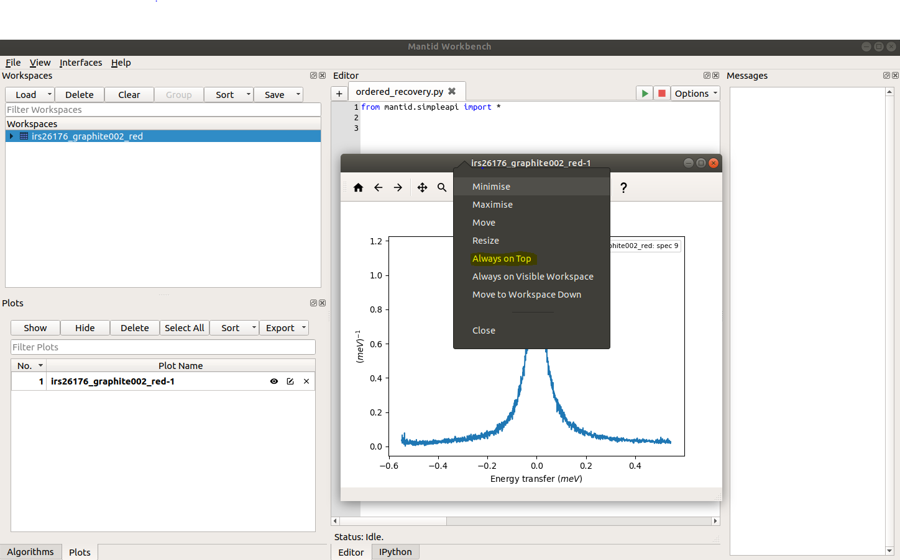

.. _WorkbenchWindowBehavior:

=====================================
Workbench Additional Window Behavior
=====================================
Within workbench, there is a setting (`Additional Window Behavior`) to control the behavior of additional windows, e.g. plots.
This setting can take two values, floating or ontop, the effect of each can be summarised as follows.

- **Ontop**: The new windows (e.g plots) will stay ontop of the workbench main window
- **Floating**: The new windows (e.g plots) will be treated as separate windows, not tied to the main workbench window.
  This means they can go behind the workbench mainwindow, but may be raised again using the task bar icon.

OS Behavior
***********

These two settings have some subtle differences on each OS due to the window managers employed in each instance.
Below we summarise the behavior of these settings on each OS.

Linux
~~~~~~

On Linux, the ontop setting will cause the minimize and maximize buttons on plots to be lost, which is due to the window manager
employed. To circumvent this issue, the :ref:`plot toolbox <WorkbenchPlotsToolbox>` can be used to hide/show individual plots.

Alternatively, the user may opt for floating windows and choose which ones they would like to keep ontop using
the setting provided by the desktop environment, allowing users to set the priority of each window, |WindowOnTopLinux|.

This floating behavior of windows is identical to other software packages, such as Matlab and Spyder.

Mac
~~~~~~
Likewise on Mac, the ontop setting will also remove the minimize button. If the user wishes to use floating windows,
the priority of windows can be controlled through packages such as afloat (https://github.com/rwu823/afloat).

Windows
~~~~~~~
On windows the ontop setting will keep plots ontop of the workbench window, while preserving both the minimize and maximize buttons.
