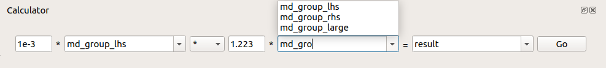

.. _WorkbenchWorkspaceCalculator:

====================
Workspace Calculator
====================

The workspace calculator allows to quickly perform binary operations
on selected workspace pairs along with simultaneous scaling by arbitrary
floating point numbers, provided they are different from zero.

Supported workspaces
--------------------

The operations can be performed on `SingleValuedWorkspace`, :ref:`MatrixWorkspace`,
:ref:`EventWorkspace`, :ref:`MDHistoWorkspace`, and :ref:`WorkspaceGroup`.

The LHS and RHS, as well as the output workspace name can be selected
using `WorkspaceSelector`.

Operation options
-----------------

The options are to perform the four basic arithmetic operations, namely
addition (`+`), subtraction (`-`), multiplication (`*`), and division (`/`),
as well as weighted mean  of the inputs (`WM`). It is not possible to perform
the latter over a mixed input consisting of :ref:`WorkspaceGroup`
and non-group workspace types.

The output of the operation, if successful, is placed in the ADS with the chosen
name, specified through the final `WorkspaceSelector`. Should no name be provided,
a default one, `output`, is used instead.
