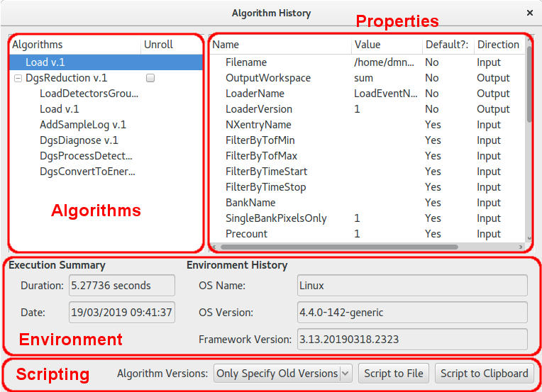

.. _WorkbenchWorkspaceHistoryWindow:

========================
Workspace History Window
========================

This window displays the algorithm history attached to a selected workspace. The window is accessed by right clicking
the workspace name in the :ref:`WorkbenchWorkspaceToolbox` and selecting "Show History".

Algorithms
----------

The algorithms box displays the list of algorithms, in order, as they were executed on the workspace. Some types of
algorithms, known as workflow algorithms, also record the algorithms they use internally. These algorithms are initially
displayed having just the parent algorithm in the list but with an option to expand the tree next to the item. Clicking
this item displays an indented list of the child algorithms used by this step.

The "Unroll" check box will also appear next to workflow algorithms. This option is used in conjunction with the the options
in the scripting section.

Properties
----------

Clicking on an algorithm from the algorithms box updates the "Properties" tree with the values of the inputs and outputs
captured when the algorithm was executed.

Environment
-----------

This section displays information regarding the execution data and duration of an algorithm when highlighted in the list. It also
displays a information regarding the OS and version of mantid used to execute the algorithm.

Scripting
---------

The scripting section allows a Python script to be generated from the history of the workspace. "Script To File" will request
a name and directory for where to save the script whereas "Script to Clipboard" will copy the script to the system clipboard.

When generating the script there are several options undre "Algorithm Versions" that control how the calls to algorithms will
look in the generated script:

- *Only specify Old Versions*: will cause a ``Version=`` argument to be given when calling an algorithm in the cases where the
  ersion of the algorithm executed is older than the current highest version
- *Never Specify Versions*: will not append any ``Version=`` arguments in any algorithm calls in the script
- *Always Specify Versions*: will specify a ``Version=`` argument for each algorithm call in the generated script with the version
  to match the version that was executed in the history.

Unrolling
#########

When a workflow algorithm appears in the history the user is offered a check box next to the algorithm within the list box that is
marked ``Unroll``. Checking this box and clicking either of the "Script to..." options will the cause the generated script to
display the list of child algorithms rather than a single call to the parent algorithm. For example, in the case of the example
in the screen shot above, the generated scripts would produce

.. code-block:: python

   Load(Filename='/tmp/data/CNCS_23936_event.nxs+/tmp/data/CNCS_23937_event.nxs', OutputWorkspace='sum')
   DgsReduction(SampleInputWorkspace='sum', EnergyTransferRange='-0.2,0.05,2.2', GroupingFile='CNCS_powder_group.xml', IncidentBeamNormalisation='ByCurrent', TimeIndepBackgroundSub=True, TibTofRangeStart=42648.741698242302, TibTofRangeEnd=45048.741698242302, DetectorVanadiumInputFile='/home/dmn58364/Code/mantidproject/mantid/builds/debug/ExternalData/Testing/Data/SystemTest/CNCS_51936_event.nxs', SaveProcessedDetVan=True, SaveProcDetVanFilename='/home/dmn58364/Code/mantidproject/mantid/builds/debug/van.nx5', UseBoundsForDetVan=True, DetVanIntRangeLow=52000, DetVanIntRangeHigh=53000, DetVanIntRangeUnits='TOF', OutputWorkspace='reduced')

when ``Unroll`` is not checked and

.. code-block:: python

   Load(Filename='tmp/data/CNCS_23936_event.nxs+/tmp/data/CNCS_23937_event.nxs', OutputWorkspace='sum')

   # Child algorithms of DgsReduction
   LoadDetectorsGroupingFile(InputFile='CNCS_powder_group.xml', OutputWorkspace='__TMP0x1643e400')
   Load(Filename='/tmp/data/CNCS_51936_event.nxs', OutputWorkspace='__TMP0x105f1000')
   AddSampleLog(Workspace='__TMP0x105f1000', LogName='Filename', LogText='/tmp/data/CNCS_51936_event.nxs')
   DgsDiagnose(DetVanWorkspace='__TMP0x105f1000', SampleWorkspace='sum', OutputWorkspace='__TMP0x19148d20')
   DgsProcessDetectorVanadium(InputWorkspace='__TMP0x105f1000', MaskWorkspace='__TMP0x19148d20', OutputWorkspace='__TMP0xde82400')
   DgsConvertToEnergyTransfer(InputWorkspace='sum', IntegratedDetectorVanadium='__TMP0xde82400', MaskWorkspace='__TMP0x19148d20', OutputWorkspace='reduced', OutputTibWorkspace='__TMP0x628bf400')
   # End of child algorithms of DgsReduction

when ``Unroll`` is checked. Please note that the exact values of some of the workspace inputs will not match exactly when run on your
own machine. This is expected.
