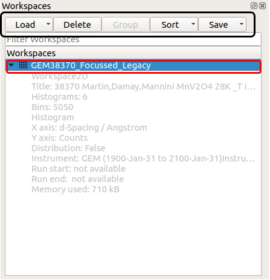
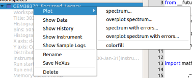

.. _WorkbenchWorkspaceToolbox:

=================
Workspace Toolbox
=================
The workspace toolbox is a key part of workbench and if a you are familiar with
MantidPlot it functions very similarly. From here you can see all of the
workspaces currently available to the user. You can load, save, group,
delete, sort, plot and more.

Workspace
---------

The workspaces listed in the Workspace Toolbox will display their metadata when
the dropdown arrow is toggled, this is showed in the diagram under the
Workspace label. If you right click the Workspaces displayed in the
toolbox it will display the context menu for a Workspace.
If you double click the workspace object a window pops up showing the
workspace's data.

Workspace Options
-----------------

The workspace options are relatively self explanatory, however key differences
include that **Load** has the option to load a file or run a live data
listener. **Delete** will remove the Workspace from the Workbench. After
selecting multiple workspaces click the **Group** button to group the
workspaces into a :ref:`WorkspaceGroup`. The Sort option has multiple choices,
you can sort in ascending or descending order by name, size, or last modified.

Workspace Context Menu
----------------------

The right-click menu on workspaces shows options to plot, show types of
metadata, rename the workspace, save the workspace or remove it.
